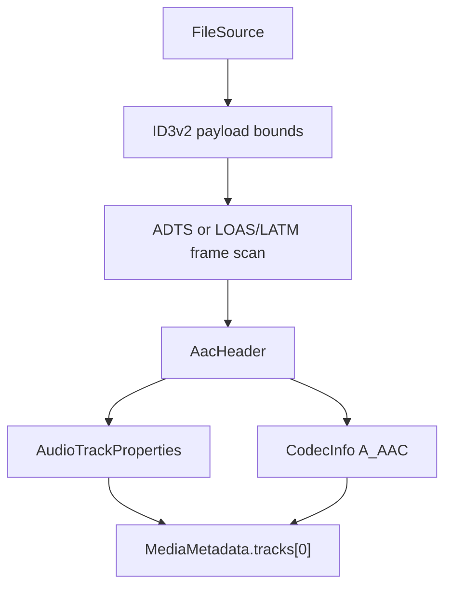

# AAC Parser

Implementation progress: 96%

## Purpose

The AAC parser recognises raw AAC streams and reports one audio track with codec identity, profile, channel count, sampling frequency, and output sampling frequency when SBR is present. It covers the two raw stream forms that matter for mkvmerge parity: ADTS and LOAS/LATM. ID3v2 data at the beginning of a file is skipped before probing.

## Implementation

- Primary implementation: `src-tauri/src/media_metadata/audio/aac.rs`
- Shared helper: `src-tauri/src/media_metadata/audio/id3v2.rs`
- Upstream basis: `../mkvtoolnix/src/input/r_aac.cpp`, `../mkvtoolnix/src/input/r_aac.h`, `../mkvtoolnix/src/common/aac.cpp`, `../mkvtoolnix/src/common/aac.h`

The Rust reader decodes ADTS fixed and variable headers, AudioSpecificConfig, program-config elements, and LOAS/LATM stream-mux configuration. Probing requires eight consecutive valid frames, mirroring mkvmerge's raw-audio confirmation policy. `read_headers` samples a bounded prefix, locates the confirmed base offset, then **drains frames until one reports both a nonzero sample rate and a nonzero channel count** (`drain_to_usable_header`), exactly mirroring `aac_reader_c::read_headers`'s `while (frames_available()) { … if (sr>0 && ch>0) break; }` loop (`../mkvtoolnix/src/input/r_aac.cpp:61-64`). If no frame qualifies, the last decoded frame's header is kept. It then writes a `ContainerFormat::Aac` container plus one `TrackType::Audio` track.

Object type 29 (Parametric Stereo / HE-AACv2) is decoded as an SBR-style extension — when its bitstream guard passes, the output sample rate and inner object type are read and `aac_ps_present` is set, mirroring `header_c::parse_audio_specific_config` (`../mkvtoolnix/src/common/aac.cpp:1224-1232`). Raw-AAC identification promotes ADTS headers with a sample rate of 24 kHz or below to the SBR profile (`PROFILE_SBR`), matching `aac_reader_c::read_headers`/`identify` (`../mkvtoolnix/src/input/r_aac.cpp:73-76`); the core sampling frequency is still reported as-is.

## Data Structures

Key local structures are `AacHeader`, `MultiplexType`, `LatmResult`, and the small bit reader used for AudioSpecificConfig and LATM payloads.

## Gaps and Handling

Upstream has broader AAC parser branches for less common object types and error-protection details. The Rust parser does not fully mirror ER AAC ELD/CELP paths. The first-usable-frame search now matches upstream (`drain_to_usable_header`), so a stream whose leading frame carries `channel_configuration == 0` without a PCE is reported from the first frame that actually carries the audio properties rather than with missing channels/rate.

Packet framing and muxing are upstream responsibilities and are intentionally out of scope for this parser.
