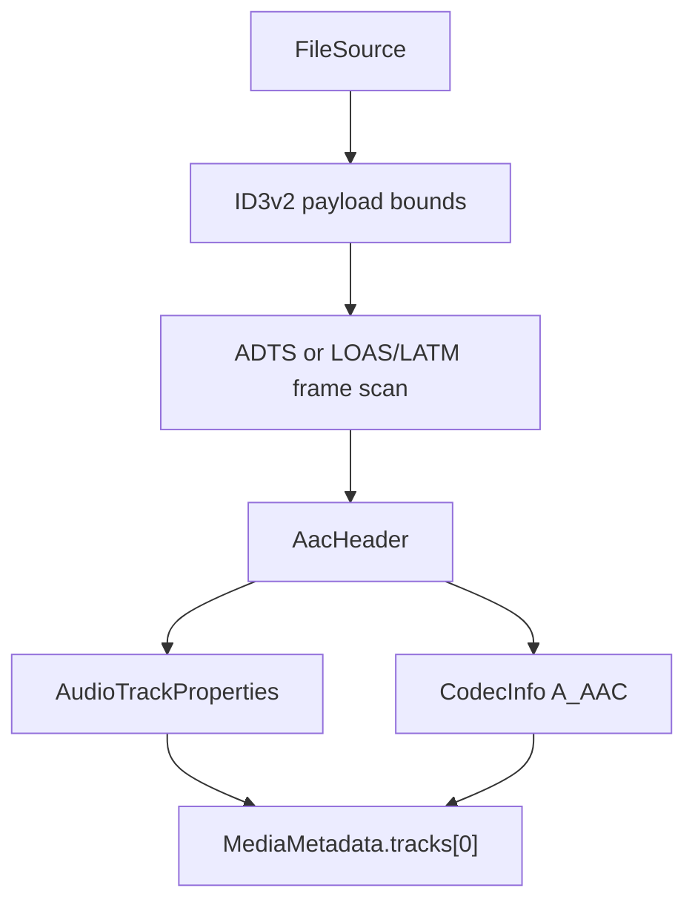

# AAC Parser

Implementation progress: 90%

## Purpose

The AAC parser recognises raw AAC streams and reports one audio track with codec identity, profile, channel count, sampling frequency, and output sampling frequency when SBR is present. It covers the two raw stream forms that matter for mkvmerge parity: ADTS and LOAS/LATM. ID3v2 data at the beginning of a file is skipped before probing.

## Implementation

- Primary implementation: `src-tauri/src/media_metadata/audio/aac.rs`
- Shared helper: `src-tauri/src/media_metadata/audio/id3v2.rs`
- Upstream basis: `../mkvtoolnix/src/input/r_aac.cpp`, `../mkvtoolnix/src/input/r_aac.h`, `../mkvtoolnix/src/common/aac.cpp`, `../mkvtoolnix/src/common/aac.h`

The Rust reader decodes ADTS fixed and variable headers, AudioSpecificConfig, program-config elements, and LOAS/LATM stream-mux configuration. Probing requires eight consecutive valid frames, mirroring mkvmerge's raw-audio confirmation policy. `read_headers` samples a bounded prefix, collects usable frame headers, and writes a `ContainerFormat::Aac` container plus one `TrackType::Audio` track.

## Data Structures

Key local structures are `AacHeader`, `MultiplexType`, `LatmResult`, and the small bit reader used for AudioSpecificConfig and LATM payloads.

## Gaps and Handling

Upstream has broader AAC parser branches for less common object types and error-protection details. The Rust parser does not fully mirror ER AAC ELD/CELP paths, ADTS implicit-SBR profile overrides, or mkvmerge's exact search for the first nonzero usable header. Those gaps are handled by returning conservative metadata from the first stable frame sequence and by keeping malformed or underspecified data out of the track list instead of guessing unsupported details.

Packet framing and muxing are upstream responsibilities and are intentionally out of scope for this parser.

## Open Issues

### PARSER-214: AudioSpecificConfig object type PS is not handled as HE-AACv2

Native ASC decoding has `AOT_SBR` but no `AOT_PS` constant (`src-tauri/src/media_metadata/audio/aac.rs:78-91`), only enters the explicit-extension branch for SBR (`aac.rs:375-381`), and always reports `aac_ps_present: Some(false)` in shared codec config (`aac.rs:458-466`). Upstream treats PS object type 29 as an SBR-style extension when its bitstream guard passes, reads the output sample rate, and then reads the inner object type (`../mkvtoolnix/src/common/aac.cpp:1224-1232`). HE-AACv2 configs in MP4/FLV/RealMedia/LATM can therefore be reported with the wrong object type/profile, no output sample rate, and `aac_ps_present=false`.

### PARSER-215: Raw ADTS implicit-SBR promotion is missing

Native ADTS header decoding always sets `sbr: false` and `output_sample_rate: 0` (`src-tauri/src/media_metadata/audio/aac.rs:275-282`), and raw AAC `read_headers()` passes that header through without the low-sample-rate override (`aac.rs:810-820`). Upstream raw AAC identification promotes ADTS headers with sample rates up to 24 kHz to SBR before identify output (`../mkvtoolnix/src/input/r_aac.cpp:73-80`). Low-rate ADTS files that mkvmerge reports as AAC SBR are therefore reported natively as plain AAC with no output sampling frequency.
