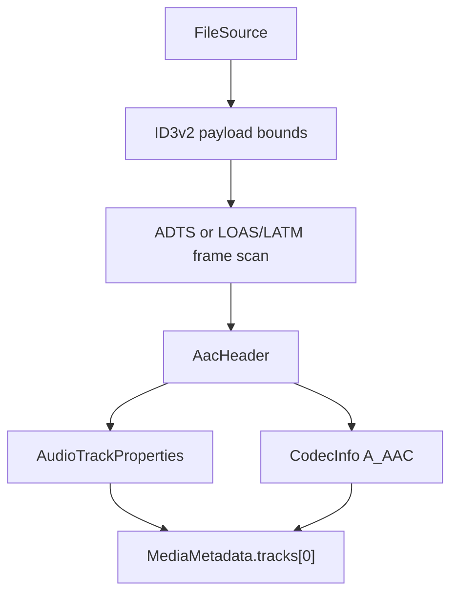

# AAC Parser

Implementation progress: 100%

## Purpose

The AAC parser recognises raw AAC streams and reports one audio track with codec identity, profile, channel count, sampling frequency, and output sampling frequency when SBR is present. It covers the two raw stream forms that matter for mkvmerge parity: ADTS and LOAS/LATM. ID3v2 data at the beginning of a file is skipped before probing.

## Implementation

- Primary implementation: `src-tauri/src/media_metadata/audio/aac.rs`
- Shared helper: `src-tauri/src/media_metadata/audio/id3v2.rs`
- Upstream basis: `../mkvtoolnix/src/input/r_aac.cpp`, `../mkvtoolnix/src/input/r_aac.h`, `../mkvtoolnix/src/common/aac.cpp`, `../mkvtoolnix/src/common/aac.h`

The Rust reader decodes ADTS fixed and variable headers, AudioSpecificConfig, program-config elements, and LOAS/LATM stream-mux configuration. Probing mirrors mkvmerge's raw-audio detection cascade after ID3 trimming: eight frames at the payload start inside 128 KiB, ambiguous 64-frame windows through 1 MiB, a one-frame-at-start phase inside 32 KiB, then 20-frame ambiguous windows through 1 MiB. The shared ID3v2 helper validates the same version and synchsafe-size bytes as `mtx::id3::skip_v2_tag`, and bounded probe payload ranges are clamped to the bytes actually read, so malformed `ID3`-looking prefixes are treated as payload rather than skipped (PARSER-359). `read_headers` samples the same bounded prefix, locates the confirmed base offset, then **drains frames until one reports both a nonzero sample rate and a nonzero channel count** (`drain_to_usable_header`), exactly mirroring `aac_reader_c::read_headers`'s `while (frames_available()) { … if (sr>0 && ch>0) break; }` loop (`../mkvtoolnix/src/input/r_aac.cpp:61-64`). If no frame qualifies, the last decoded frame's header is kept. It then writes a `ContainerFormat::Aac` container plus one `TrackType::Audio` track (PARSER-354).

Object type 29 (Parametric Stereo / HE-AACv2) is decoded as an SBR-style extension — when its bitstream guard passes, the output sample rate and inner object type are read and `aac_ps_present` is set, mirroring `header_c::parse_audio_specific_config` (`../mkvtoolnix/src/common/aac.cpp:1224-1232`). Raw-AAC identification promotes ADTS headers with a sample rate of 24 kHz or below to the SBR profile (`PROFILE_SBR`), matching `aac_reader_c::read_headers`/`identify` (`../mkvtoolnix/src/input/r_aac.cpp:73-76`); the core sampling frequency is still reported as-is.

The object-type dispatch in `parse_audio_specific_config` mirrors mkvtoolnix exactly: GA objects (AAC Main/LC/SSR/LTP/Scalable/TwinVQ and the ER AAC LC/LTP/Scalable/TwinVQ/BSAC/LD set) run `read_ga_specific_config` — which now also consumes the scalable `layer_nr` and the `extension_flag` block (ER-BSAC sub-frame length, ER resilience flags); ER AAC ELD runs `read_eld_specific_config` (rejecting the configurations upstream `throw false`s on); every remaining object type runs `read_er_celp_specific_config` (matching upstream's always-true `else if (AUDIO_OBJECT_TYPE_ER_CELP)` whose `throw unsupported` branch is dead). After the object-specific config, the ER `ep_config` is read for ER AAC LC and the ER-AAC-LTP…ER-Param range, dispatching to `read_error_protection_specific_config` for `ep_config` 2/3 and consuming the `direct_mapping` bit for `ep_config` 3. This keeps the bit cursor aligned before the SBR sync-extension search for every ASC form (ADTS, LOAS/LATM, and container-provided sequence headers).

## Data Structures

Key local structures are `AacHeader`, `MultiplexType`, `LatmResult`, and the small bit reader used for AudioSpecificConfig and LATM payloads.

## Gaps and Handling

Upstream has broader AAC parser branches for less common object types and error-protection details, all of which are now mirrored (ELD/CELP/ER error-protection plus the GA extension-flag block). Raw probing and the first-usable-frame search also match upstream, so short mid-file sync runs are rejected, later ambiguous windows are considered, and a stream whose leading frame carries `channel_configuration == 0` without a PCE is reported from the first frame that actually carries the audio properties rather than with missing channels/rate.

Packet framing and muxing are upstream responsibilities and are intentionally out of scope for this parser.
