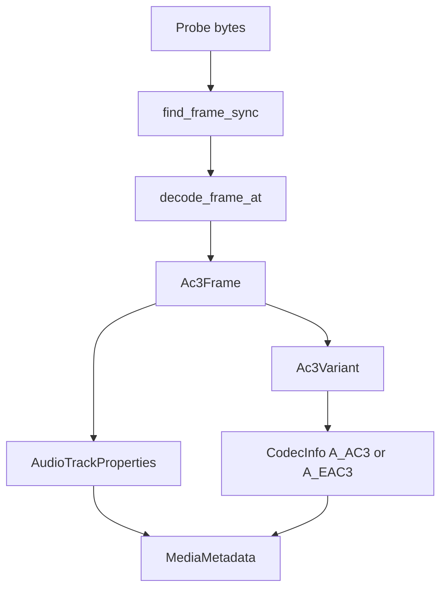

# AC-3 / E-AC-3 Parser

Implementation progress: 100%

## Purpose

The AC-3 parser recognises raw Dolby Digital and Dolby Digital Plus streams, including byte-swapped sync, and reports codec variant, sample rate, channel count, bitrate, and frame duration where the header exposes them.

## Implementation

- Primary implementation: `src-tauri/src/media_metadata/audio/ac3.rs`
- Upstream basis: `../mkvtoolnix/src/input/r_ac3.cpp`, `../mkvtoolnix/src/input/r_ac3.h`, `../mkvtoolnix/src/common/ac3.cpp`, `../mkvtoolnix/src/common/ac3.h`

`decode_frame` reads the sync word, decides between AC-3 and E-AC-3 from `bsid`, decodes rate/channel/frame-size fields, and supports the common IEC 61937 preamble offset. For E-AC-3 the decode continues past `lfeon` through `dialnorm`/`compre`, the dual-mono second `dialnorm`, and — for dependent frames — the `chanmape`/`chanmap` block, so each frame carries a speaker-layout bitmask. The reader's `probe` mirrors mkvmerge's raw-audio detection cascade after ID3 trimming: eight frames at the payload start inside 128 KiB, ambiguous 64-frame windows through 1 MiB, a one-frame-at-start phase inside 32 KiB, then 20-frame ambiguous windows through 1 MiB. `read_headers` decodes the first independent frame from the same selected base and then folds any immediately-following dependent E-AC-3 frames into the effective channel count (`get_effective_number_of_channels`: OR of all layouts + each frame's LFE), populating `ContainerFormat::Ac3` or `ContainerFormat::Eac3` (PARSER-354).

## Data Structures

Key structures are `Ac3Frame` and `Ac3Variant`. Bit-level parsing uses the shared `BitReader`.

## Gaps and Handling

The parser now folds dependent-frame channel maps into the effective channel count and uses mkvtoolnix's staged raw-probe windows, including the later ambiguous 64-frame and 20-frame passes. It still tracks only the fields the `MediaMetadata` model exposes — dialog normalization, checksum state, and Dolby Surround EX detection are read past but not surfaced.

Packetizer behavior, sync repair during muxing, and checksum validation are not part of this header-only parser.
