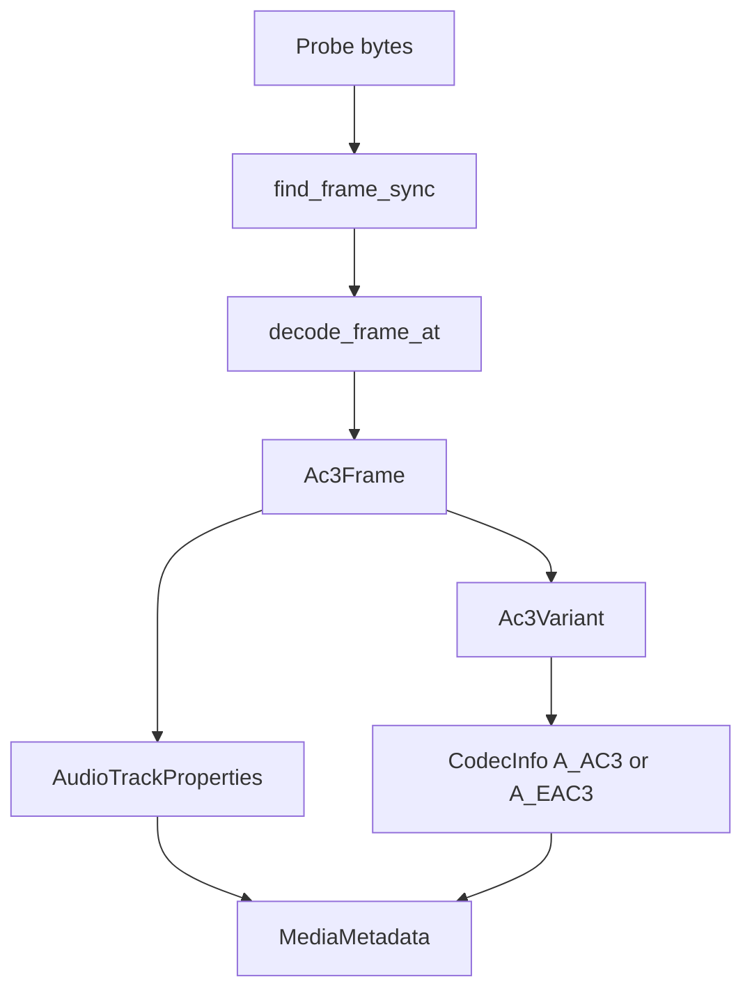

# AC-3 / E-AC-3 Parser

Implementation progress: 84%

## Purpose

The AC-3 parser recognises raw Dolby Digital and Dolby Digital Plus streams, including byte-swapped sync, and reports codec variant, sample rate, channel count, bitrate, and frame duration where the header exposes them.

## Implementation

- Primary implementation: `src-tauri/src/media_metadata/audio/ac3.rs`
- Upstream basis: `../mkvtoolnix/src/input/r_ac3.cpp`, `../mkvtoolnix/src/input/r_ac3.h`, `../mkvtoolnix/src/common/ac3.cpp`, `../mkvtoolnix/src/common/ac3.h`

`decode_frame` reads the sync word, decides between AC-3 and E-AC-3 from `bsid`, decodes rate/channel/frame-size fields, and supports the common IEC 61937 preamble offset. The reader's `probe` scans for eight consecutive frames; `read_headers` uses the first decoded frame to populate `ContainerFormat::Ac3` or `ContainerFormat::Eac3`.

## Data Structures

Key structures are `Ac3Frame` and `Ac3Variant`. Bit-level parsing uses the shared `BitReader`.

## Gaps and Handling

The upstream parser has more complete E-AC-3 dependent-frame and channel-map handling. It also tracks fields such as dialog normalization and checksum-related state that the current `MediaMetadata` model does not expose. The Rust parser treats the first stable independent frame as authoritative, which keeps the metadata path fast but can under-report rare dependent-channel layouts.

Packetizer behavior, sync repair during muxing, and checksum validation are not part of this header-only parser.

## Open Issues

### PARSER-216: E-AC-3 dependent-frame channel maps are ignored

Native `decode_header_type_eac3()` stops after `acmod` and `lfeon`, derives `channels_from_acmod(acmod) + lfeon`, and does not read dependent-frame `chanmape` or keep dependent substream state (`src-tauri/src/media_metadata/audio/ac3.rs:217-245`). Upstream reads the dependent-frame channel map when present (`../mkvtoolnix/src/common/ac3.cpp:175-186`) and folds dependent frames into the effective channel layout/count (`ac3.cpp:330-348`). E-AC-3 streams using dependent substreams can therefore be under-reported in channel count.
