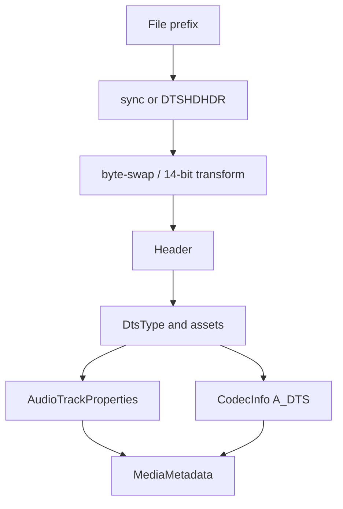

# DTS / DTS-HD Parser

Implementation progress: 100%

## Purpose

The DTS parser recognises DTS core streams and DTS-HD chunked files. It reports codec family, channel count, sample rate, bit depth, and DTS-HD specialization when the header exposes it.

## Implementation

- Primary implementation: `src-tauri/src/media_metadata/audio/dts.rs`
- Upstream basis: `../mkvtoolnix/src/input/r_dts.cpp`, `../mkvtoolnix/src/input/r_dts.h`, `../mkvtoolnix/src/common/dts.cpp`, `../mkvtoolnix/src/common/dts.h`, `../mkvtoolnix/src/common/dts_parser.cpp`, `../mkvtoolnix/src/common/dts_parser.h`

The Rust implementation detects 16-bit big-endian, 16-bit little-endian, 14-bit big-endian, and 14-bit little-endian sync forms. It can transform 14-bit and swapped data into a normal frame view before parsing. DTS-HD `DTSHDHDR` chunks are walked until EOF to find the first usable `STRMDATA` payload, and files with a DTS-HD header but no stream-data chunk are rejected instead of falling back to byte zero. Shared ID3v2 trimming rejects invalid version/synchsafe header bytes and clamps bounded probe payload ranges before slicing, matching mkvtoolnix's malformed-tag behavior (PARSER-359). Extension substreams are inspected for XLL, LBR, X96, XCH, channel masks, and source PCM resolution (PARSER-357).

## Data Structures

Key structures include `Header`, `DtsType`, internal `Asset`, and helper enums for frame and LFE types.

## Gaps and Handling

Only the first DTS-HD `STRMDATA` payload is used for metadata. Upstream keeps richer packet-era state for selecting core versus extension payloads while muxing, which is not needed for the native metadata parser. DTS-HD chunk discovery now mirrors mkvtoolnix's identify behavior by walking the chunk chain to EOF and treating a missing stream-data chunk as unrecognised.

## Open Issues

- `PARSER-386` - the reader's loose DTS probe is active during mkvtoolnix's early start-only DTS phase. Upstream calls `dts_reader_c` with `require_headers_at_start=true` before MPEG-TS/MPEG-PS/OBU, and runs the loose DTS probe only after those container probes (`reader_detection_and_creation.cpp`). `dts_reader_c::probe_file` skips its loose `detect()` path when that flag is set and accepts the strict phase only when the consecutive-header run starts at byte zero (`r_dts.cpp`). The Rust dispatch has no phase parameters and calls `DtsReader::probe`, which accepts `detect(bytes)` or any five-frame run, in the early phase as well; a container carrying DTS frames can therefore be claimed as raw DTS before mkvtoolnix would allow that.
