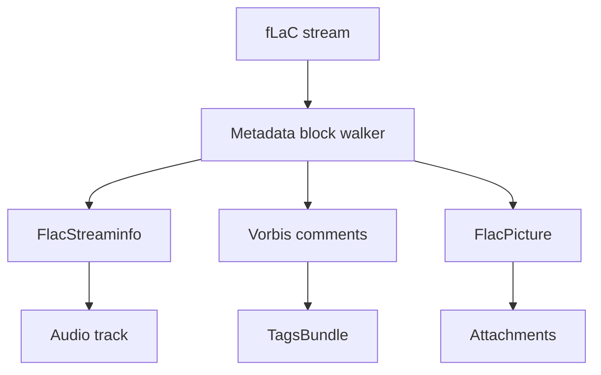

# FLAC Parser

Implementation progress: 94%

## Purpose

The FLAC parser recognises native FLAC files, extracts STREAMINFO, Vorbis comments, and picture metadata, and reports one lossless audio track plus optional attachment entries.

## Implementation

- Primary implementation: `src-tauri/src/media_metadata/audio/flac.rs`
- Shared helper: `src-tauri/src/media_metadata/audio/id3v2.rs`
- Upstream basis: `../mkvtoolnix/src/input/r_flac.cpp`, `../mkvtoolnix/src/input/r_flac.h`, `../mkvtoolnix/src/common/flac.cpp`, `../mkvtoolnix/src/common/flac.h`

The parser skips leading ID3v2 data, checks `fLaC`, walks metadata blocks, decodes STREAMINFO, maps total samples to duration, turns Vorbis comments into tags, promotes title/language fields, and turns PICTURE blocks into attachment metadata.

## Data Structures

The central structures are `FlacMetadata`, `FlacStreaminfo`, and `FlacPicture`.

## Gaps and Handling

The MIME-to-extension table for pictures is intentionally small and practical. The Rust parser does not run libFLAC frame validation, and attachment payloads are represented by metadata rather than loading full image data into the model. Those choices keep parsing bounded and match the app's need to list tracks and attachments rather than remux FLAC packets.
