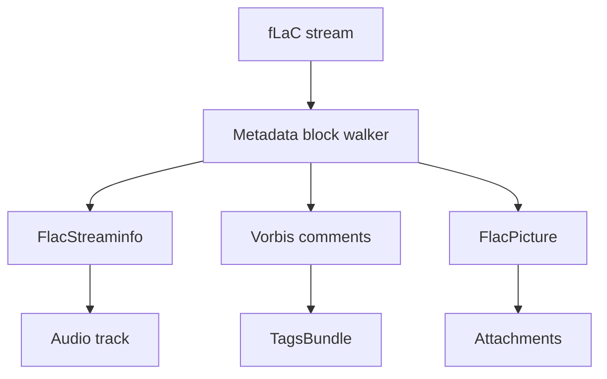

# FLAC Parser

Implementation progress: 100%

## Purpose

The FLAC parser recognises native FLAC files, extracts STREAMINFO, Vorbis comments, and picture metadata, and reports one lossless audio track plus optional attachment entries.

## Implementation

- Primary implementation: `src-tauri/src/media_metadata/audio/flac.rs`
- Shared helper: `src-tauri/src/media_metadata/audio/id3v2.rs`
- Upstream basis: `../mkvtoolnix/src/input/r_flac.cpp`, `../mkvtoolnix/src/input/r_flac.h`, `../mkvtoolnix/src/common/flac.cpp`, `../mkvtoolnix/src/common/flac.h`

The parser skips leading ID3v2 data, checks `fLaC`, walks metadata blocks until the on-disk last-metadata-block flag, EOF/truncation, or the parser deadline, decodes STREAMINFO, maps total samples to duration, turns Vorbis comments into tags, promotes title/language fields, and turns PICTURE blocks into attachment metadata. The shared ID3v2 skipper validates mkvtoolnix's version and synchsafe-size guards before seeking, so malformed `ID3`-looking prefixes are treated as payload rather than skipped (PARSER-359).

The codec-private header is rebuilt exactly as `flac_reader_c::read_headers` does (`r_flac.cpp:57-89`): the `fLaC` magic followed by **every metadata block except PICTURE and PADDING** — so STREAMINFO, VORBIS_COMMENT, APPLICATION, SEEKTABLE, CUESHEET, and any unknown blocks are all preserved verbatim — with the "last metadata block" flag re-normalised so only the final kept block carries it. PICTURE blocks become attachments using the **declared** payload length read from the block header; the image payload bytes themselves are never materialised, but the variable PICTURE header fields (MIME type, description, dimensions, and declared data length) are read completely before the payload is skipped. A block whose declared payload does not fit within the block, or extends past EOF, is dropped, matching libFLAC's all-or-nothing block read.

## Data Structures

The central structures are `FlacMetadata`, `FlacStreaminfo`, and `FlacPicture`.

## Gaps and Handling

The MIME-to-extension table for pictures is intentionally small and practical. The Rust parser does not run libFLAC frame validation, and attachment payloads are represented by metadata rather than loading full image data into the model. Native FLAC metadata block sizes are 24-bit, so kept blocks are read at their declared size under the shared parser element budget while PICTURE image data stays skipped.
