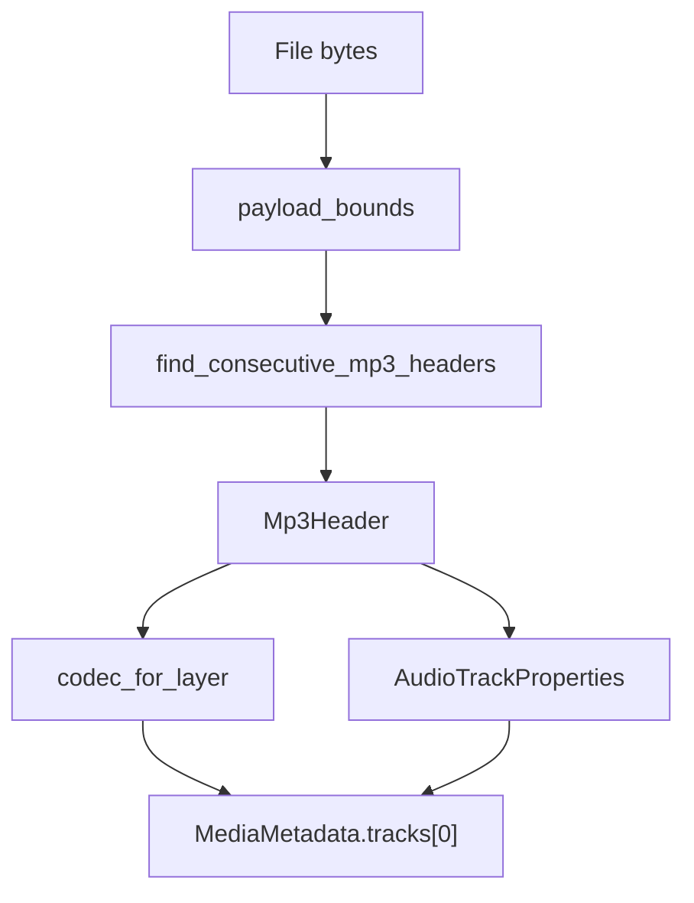

# MP3 / MPEG Audio Parser

Implementation progress: 100%

## Purpose

The MP3 parser recognises MPEG audio elementary streams, including MPEG-1, MPEG-2, MPEG-2.5 and Layers I, II, and III. It reports codec layer, sample rate, and channel count.

## Implementation

- Primary implementation: `src-tauri/src/media_metadata/audio/mp3.rs`
- Shared helper: `src-tauri/src/media_metadata/audio/id3v2.rs`
- Upstream basis: `../mkvtoolnix/src/input/r_mp3.cpp`, `../mkvtoolnix/src/input/r_mp3.h`

The reader trims ID3v2 and ID3v1 regions, decodes MPEG audio frame headers, and confirms a stream with mkvmerge's raw-audio detection cascade: eight frames at the payload start inside 128 KiB, ambiguous 64-frame windows through 1 MiB, a one-frame-at-start phase inside 32 KiB, then 20-frame ambiguous windows through 1 MiB. `read_headers` then re-runs the five-frame confirmation used by mkvmerge's MP3 reader over the bounded payload before reporting the track. The codec ID is selected from the MPEG layer, matching mkvmerge's identification behavior for MP1, MP2, and MP3 (PARSER-354).

## Data Structures

`Mp3Header` carries version, layer, bitrate, sampling frequency, channels, and frame size.

## Gaps and Handling

Upstream identification does not expose much more than codec, channels, and sampling frequency, so parity is complete for the header-level metadata surface. The Rust model naming is shaped for `MediaMetadata` rather than mkvmerge's exact display strings, but the staged probe windows and underlying codec selection follow the same layer-based behavior.

## Open Issues

- `PARSER-359` - The shared ID3v2 skipper does not match `mtx::id3::skip_v2_tag`: invalid version or synchsafe size bytes are masked and accepted, and a declared tag size beyond the bounded probe bytes can leave callers slicing past the bytes actually read. MP3 can therefore skip malformed `ID3`-looking prefixes that mkvtoolnix treats as payload, or panic instead of returning `Unrecognised`.
