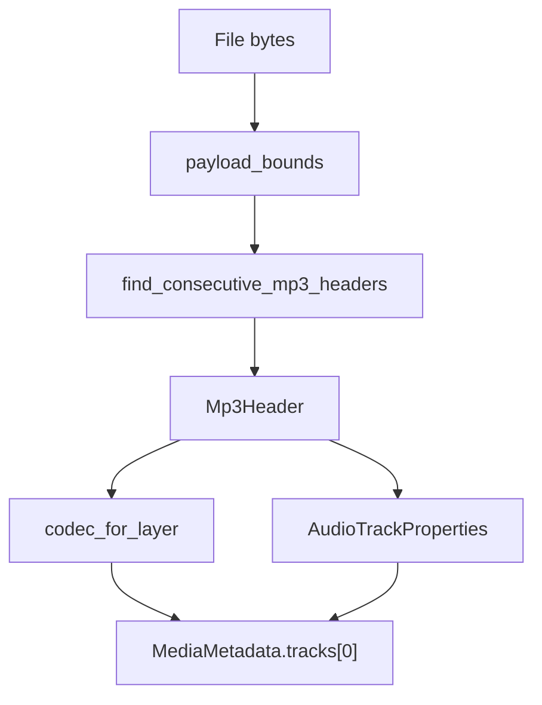

# MP3 / MPEG Audio Parser

Implementation progress: 97%

## Purpose

The MP3 parser recognises MPEG audio elementary streams, including MPEG-1, MPEG-2, MPEG-2.5 and Layers I, II, and III. It reports codec layer, sample rate, and channel count.

## Implementation

- Primary implementation: `src-tauri/src/media_metadata/audio/mp3.rs`
- Shared helper: `src-tauri/src/media_metadata/audio/id3v2.rs`
- Upstream basis: `../mkvtoolnix/src/input/r_mp3.cpp`, `../mkvtoolnix/src/input/r_mp3.h`

The reader trims ID3v2 and ID3v1 regions, decodes MPEG audio frame headers, and confirms a stream by finding consecutive frames. The codec ID is selected from the MPEG layer, matching mkvmerge's identification behavior for MP1, MP2, and MP3.

## Data Structures

`Mp3Header` carries version, layer, bitrate, sampling frequency, channels, and frame size.

## Gaps and Handling

Upstream identification does not expose much more than codec, channels, and sampling frequency, so parity is high. The Rust model naming is shaped for `MediaMetadata` rather than mkvmerge's exact display strings, but the underlying codec selection follows the same layer-based behavior.
