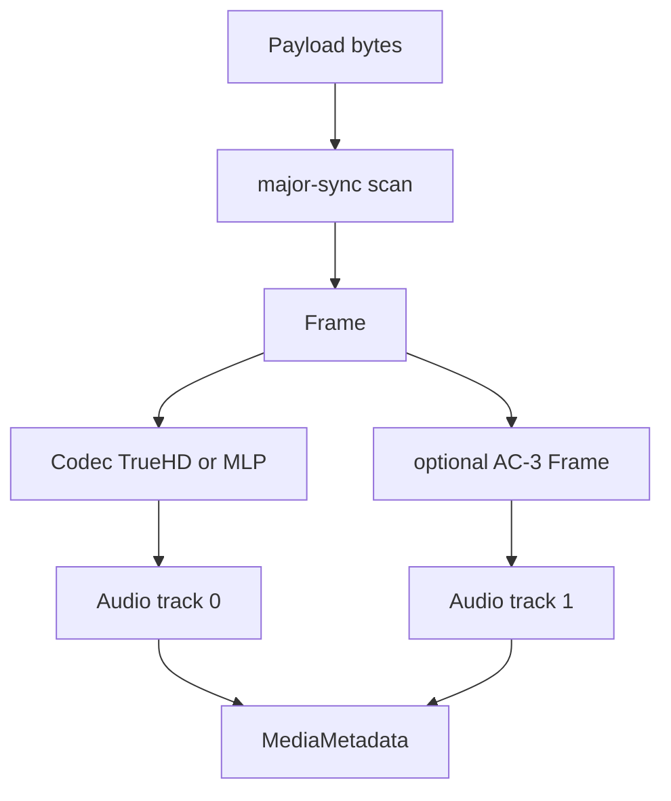

# TrueHD / MLP Parser

Implementation progress: 92%

## Purpose

The TrueHD parser recognises Dolby TrueHD and MLP streams, extracts sample rate and channel count, and reports an embedded AC-3 substream as a second audio track when present.

## Implementation

- Primary implementation: `src-tauri/src/media_metadata/audio/truehd.rs`
- Upstream basis: `../mkvtoolnix/src/input/r_truehd.cpp`, `../mkvtoolnix/src/input/r_truehd.h`, `../mkvtoolnix/src/common/truehd.cpp`, `../mkvtoolnix/src/common/truehd.h`, `../mkvtoolnix/src/common/ac3.cpp`, `../mkvtoolnix/src/common/ac3.h`

The parser skips ID3v2 data, searches major-sync words, classifies MLP versus TrueHD, decodes rate and channel-map fields, and scans enough frames to find both the main stream and a coupled AC-3 frame.

## Data Structures

Key structures are `Frame`, `Codec`, and `FrameType`.

## Gaps and Handling

The Rust parser does not verify AC-3 checksums and does not expose less common debug or Atmos extension fields that upstream can inspect while muxing. The current metadata model records the stream identity and usable audio properties, which are the fields the UI consumes.
