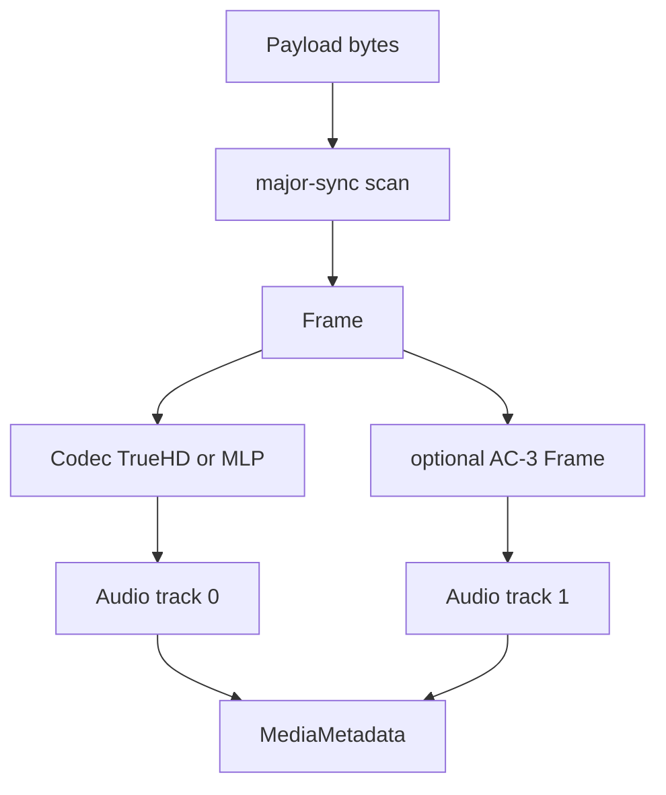

# TrueHD / MLP Parser

Implementation progress: 100%

## Purpose

The TrueHD parser recognises Dolby TrueHD and MLP streams, extracts sample rate and channel count, and reports an embedded AC-3 substream as a second audio track when present.

## Implementation

- Primary implementation: `src-tauri/src/media_metadata/audio/truehd.rs`
- Upstream basis: `../mkvtoolnix/src/input/r_truehd.cpp`, `../mkvtoolnix/src/input/r_truehd.h`, `../mkvtoolnix/src/common/truehd.cpp`, `../mkvtoolnix/src/common/truehd.h`, `../mkvtoolnix/src/common/ac3.cpp`, `../mkvtoolnix/src/common/ac3.h`

The parser skips ID3v2 data, searches the same 512 KiB probe range mkvtoolnix gives to `truehd_reader_c`, classifies MLP versus TrueHD, decodes rate and channel-map fields, and scans enough frames to find both the main stream and a coupled AC-3 frame (PARSER-356). The shared ID3v2 skipper validates mkvtoolnix's version and synchsafe-size guards before seeking, so malformed `ID3`-looking prefixes are treated as payload rather than skipped (PARSER-359).

## Data Structures

Key structures are `Frame`, `Codec`, and `FrameType`.

## Gaps and Handling

The Rust parser does not verify AC-3 checksums and does not expose less common debug or Atmos extension fields that upstream can inspect while muxing. The current metadata model records the stream identity and usable audio properties, and the probe/read window now matches mkvtoolnix's 512 KiB header-identification range.

## Open Issues

- `PARSER-388` - the TrueHD probe is ordered too early relative to mkvtoolnix's 64-frame raw-audio loop. Upstream tries the 64-frame MP3/AC-3/AAC scans after MPEG-TS/MPEG-PS/OBU and only then tries TrueHD, loose DTS, and VobButton. The Rust dispatcher places `LATE_AMBIGUOUS_READERS` before `RAW_AUDIO_SIXTY_FOUR_FRAME_READERS`, so TrueHD can claim a file that mkvtoolnix would have stopped on as raw audio first.
