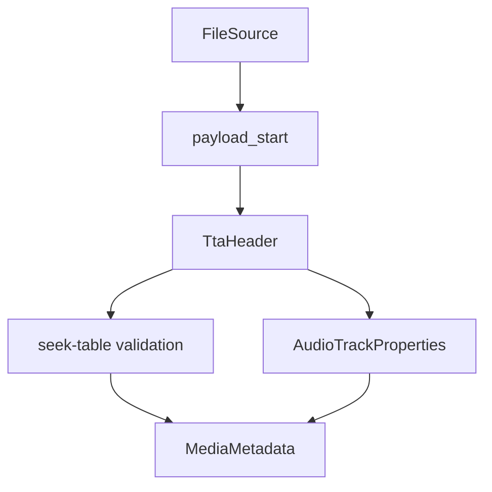

# TTA Parser

Implementation progress: 78%

## Purpose

The TTA parser recognises `TTA1` lossless audio files and reports channel count, sample rate, bit depth, total sample duration, and codec identity.

## Implementation

- Primary implementation: `src-tauri/src/media_metadata/audio/tta.rs`
- Shared helper: `src-tauri/src/media_metadata/audio/id3v2.rs`
- Upstream basis: `../mkvtoolnix/src/input/r_tta.cpp`, `../mkvtoolnix/src/input/r_tta.h`

The reader skips leading ID3v2 data, parses the fixed TTA1 header, derives duration from `data_length / sample_rate`, and validates the seek table enough to reject obviously broken headers.

## Data Structures

`TtaHeader` carries audio format, channels, bits per sample, sample rate, and sample count.

## Gaps and Handling

Upstream does not validate the seek table during identification in the same way; Rust validation can therefore reject damaged files earlier. The Rust code also does not subtract every possible trailing tag form during seek-table validation. This is conservative for a metadata parser: uncertain files fail as malformed rather than appearing extractable.

## Open Issues

### PARSER-217: Damaged seek tables reject identification

Native `read_headers()` always validates the TTA seek table and returns `Malformed` when the table length sum does not match the logical file size (`src-tauri/src/media_metadata/audio/tta.rs:100-117`). Upstream reads the TTA header and immediately returns during identification before seek-table validation (`../mkvtoolnix/src/input/r_tta.cpp:48-60`); the seek-table walk only runs for non-identify muxing (`r_tta.cpp:61-80`). Damaged files that mkvmerge can still identify from the fixed header fail native metadata parsing entirely.
