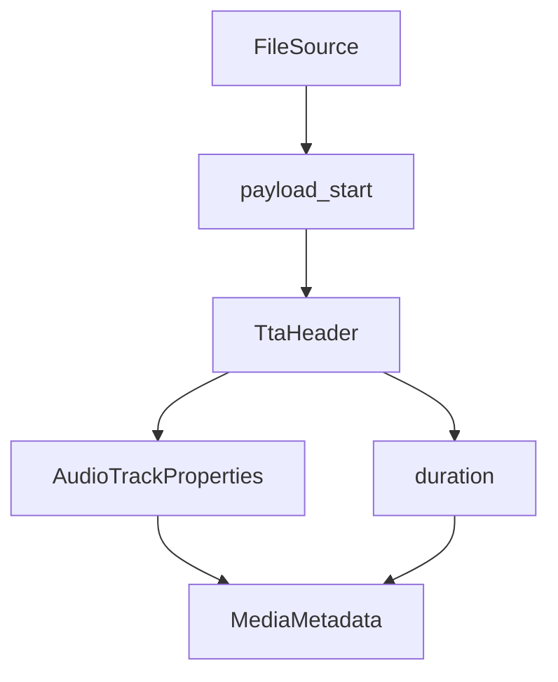

# TTA Parser

Implementation progress: 85%

## Purpose

The TTA parser recognises `TTA1` lossless audio files and reports channel count, sample rate, bit depth, total sample duration, and codec identity.

## Implementation

- Primary implementation: `src-tauri/src/media_metadata/audio/tta.rs`
- Shared helper: `src-tauri/src/media_metadata/audio/id3v2.rs`
- Upstream basis: `../mkvtoolnix/src/input/r_tta.cpp`, `../mkvtoolnix/src/input/r_tta.h`

The reader skips leading ID3v2 data, parses the fixed TTA1 header, and derives duration from `data_length / sample_rate`. Matching `tta_reader_c::read_headers`, which returns right after the fixed header during identification (`g_identifying`) and only walks the seek table for non-identify muxing, the seek table is not validated — this is exactly the identification role.

## Data Structures

`TtaHeader` carries audio format, channels, bits per sample, sample rate, and sample count.

## Gaps and Handling

Like mkvmerge's identification path, the reader no longer validates the seek table, so damaged files that still carry a valid fixed header are identified rather than rejected. The seek-table walk and its trailing-tag accounting (`tag_present_at_end`) are muxing-time concerns outside this header-only parser.

## Open Issues

- `PARSER-359` - The shared ID3v2 skipper does not match `mtx::id3::skip_v2_tag`: invalid version or synchsafe size bytes are masked and accepted, and declared tag-size semantics are not propagated as mkvtoolnix's `-1`/`0`/size result. TTA can therefore skip malformed `ID3`-looking prefixes that mkvtoolnix treats as payload, changing probe and header behavior.
