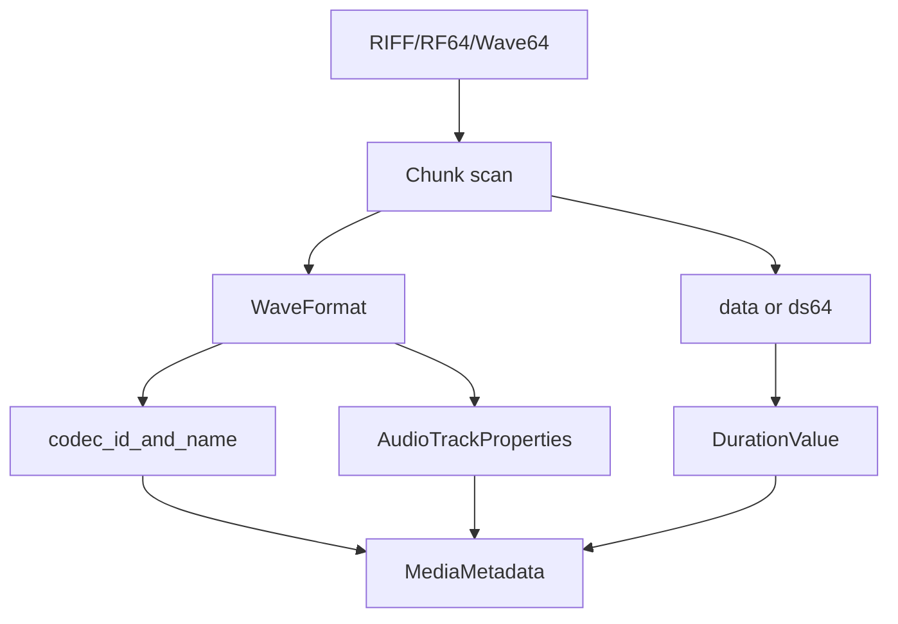

# WAV / RF64 / Wave64 Parser

Implementation progress: 94%

## Purpose

The WAV parser recognises RIFF/WAVE, RF64, and Wave64 files. It extracts WAVEFORMATEX or WAVEFORMATEXTENSIBLE audio properties and supports PCM, IEEE float, AC-3-in-WAV, and DTS-in-WAV identification.

## Implementation

- Primary implementation: `src-tauri/src/media_metadata/audio/wav.rs`
- Upstream basis: `../mkvtoolnix/src/input/r_wav.cpp`, `../mkvtoolnix/src/input/r_wav.h`, plus upstream Wave64 helpers

The parser detects the wrapper type, scans chunks, parses `fmt `, reads RF64 `ds64` where present, detects Wave64 GUID chunks, and derives duration from data size and block alignment. The payload byte total **sums the lengths of every `data` chunk** (mirroring `scan_chunks_wave`'s `m_bytes_in_data_chunks += new_chunk.len`); RF64 overrides the total with the `ds64` `data_size`. For classic RIFF/WAVE files larger than 4 GiB whose 32-bit `data` length wrapped or was written incorrectly, `scan_chunks_riff` mirrors `scan_chunks_wave`'s repair: when a non-`data` chunk follows a `data` chunk and the file is larger than 4 GiB, the previous `data` chunk's length is recomputed from `file_size - previous.pos` and the scan stops (PARSER-254). The AC-3/DTS payload sniffers probe the first data chunk (matching `find_chunk("data", 0, false)` plus the demuxer probe at that position) and promote AC-3 and DTS-in-WAV streams to their corresponding codec IDs.

## Data Structures

Important structures are `WavType`, `WaveFormat`, `WavMetadata`, and internal chunk descriptors.

## Gaps and Handling

The byte total now accumulates all data chunks like upstream, so duration is correct for multi-`data`-chunk files, and the >4 GiB data-length repair matches `scan_chunks_wave`. Unsupported format tags are reported through the structured model rather than matching mkvmerge's exact text output.

## Open Issues

- `PARSER-301` — RIFF chunk scanning applies word-alignment padding that mkvtoolnix does not apply. Odd-length chunks advance by `len + 1` in Rust, while `scan_chunks_wave` seeks by exactly `len`, so Rust can recover following chunks from padded files that upstream mis-parses or rejects.
- `PARSER-302` — The primary `data` chunk lookup allows zero-length chunks. Upstream calls `find_chunk("data", 0, false)`, where `false` means empty chunks are not accepted, but Rust passes `false` to a `require_non_empty` parameter. An empty `data` chunk can therefore still produce a supported WAV track in Rust.
- `PARSER-303` — AC-3/DTS WAV support is decided by the format tag instead of the upstream demuxer probes. Rust marks `0x2000` and `0x2001` supported even when the data payload does not contain enough consecutive AC-3/DTS frames; mkvtoolnix only keeps those demuxers after their `probe()` methods validate real headers.
