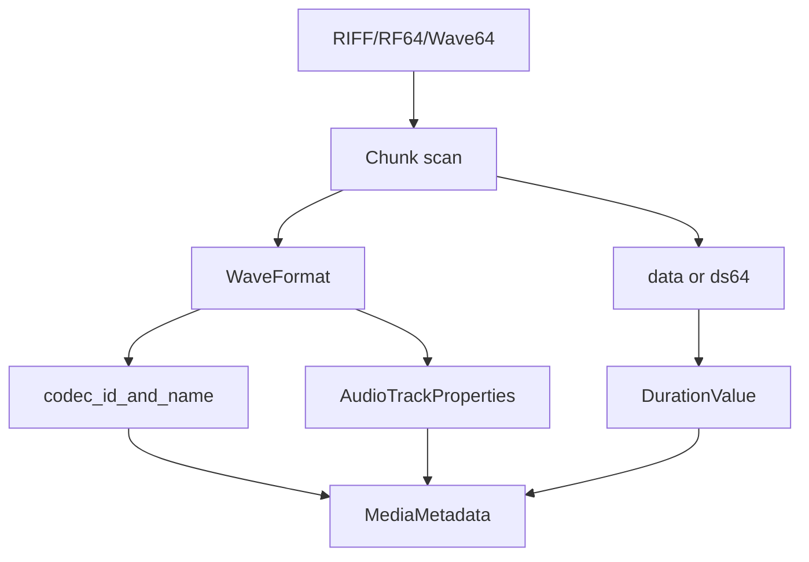

# WAV / RF64 / Wave64 Parser

Implementation progress: 88%

## Purpose

The WAV parser recognises RIFF/WAVE, RF64, and Wave64 files. It extracts WAVEFORMATEX or WAVEFORMATEXTENSIBLE audio properties and supports PCM, IEEE float, AC-3-in-WAV, and DTS-in-WAV identification.

## Implementation

- Primary implementation: `src-tauri/src/media_metadata/audio/wav.rs`
- Upstream basis: `../mkvtoolnix/src/input/r_wav.cpp`, `../mkvtoolnix/src/input/r_wav.h`, plus upstream Wave64 helpers

The parser detects the wrapper type, scans chunks, parses `fmt `, reads RF64 `ds64` where present, detects Wave64 GUID chunks, and derives duration from data size and block alignment. Payload sniffers promote AC-3 and DTS-in-WAV streams to their corresponding codec IDs.

## Data Structures

Important structures are `WavType`, `WaveFormat`, `WavMetadata`, and internal chunk descriptors.

## Gaps and Handling

Upstream has additional repair logic for very large or broken data-length fields and may aggregate more than one data chunk. The Rust parser uses the first usable data chunk for duration and reports unsupported format tags through the structured model instead of matching mkvmerge's exact text output.

## Open Issues

- `PARSER-227`: Duration and byte accounting still use the first `data` chunk only. mkvmerge accumulates all RIFF/Wave64 data chunks and reads them in sequence, so files with multiple data chunks are under-reported and may be classified from the wrong payload prefix.
