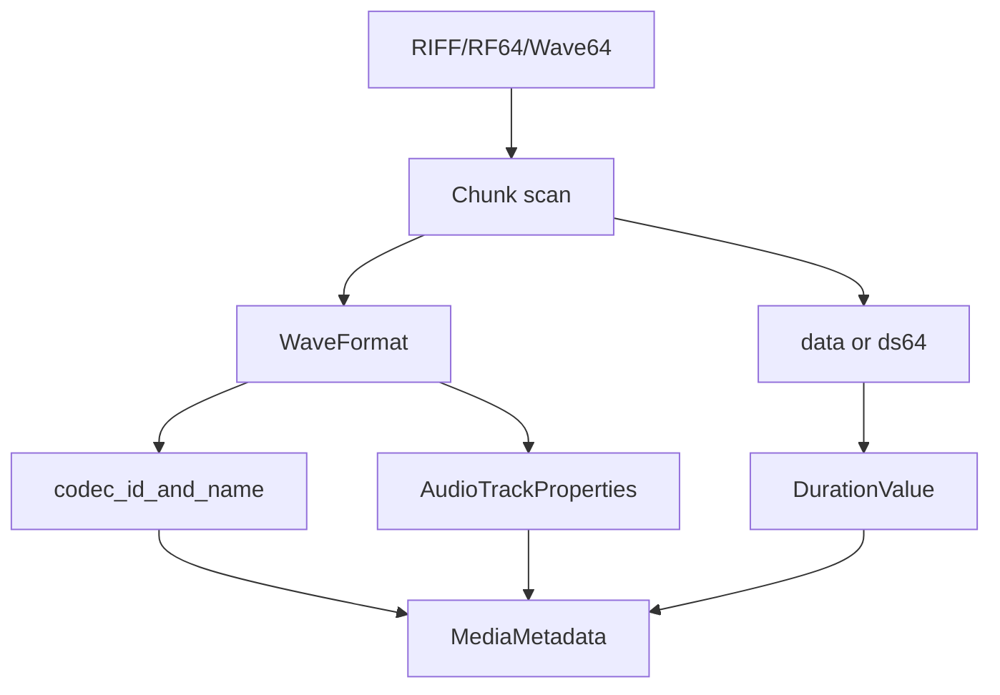

# WAV / RF64 / Wave64 Parser

Implementation progress: 98%

## Purpose

The WAV parser recognises RIFF/WAVE, RF64, and Wave64 files. It extracts WAVEFORMATEX or WAVEFORMATEXTENSIBLE audio properties and supports PCM, IEEE float, AC-3-in-WAV, and DTS-in-WAV identification.

## Implementation

- Primary implementation: `src-tauri/src/media_metadata/audio/wav.rs`
- Upstream basis: `../mkvtoolnix/src/input/r_wav.cpp`, `../mkvtoolnix/src/input/r_wav.h`, plus upstream Wave64 helpers

The parser detects the wrapper type, scans chunks, parses `fmt `, reads RF64 `ds64` where present, detects Wave64 GUID chunks, and derives duration from data size and block alignment. The payload byte total **sums the lengths of every `data` chunk** (mirroring `scan_chunks_wave`'s `m_bytes_in_data_chunks += new_chunk.len`); RF64 overrides the total with the `ds64` `data_size`. For classic RIFF/WAVE files larger than 4 GiB whose 32-bit `data` length wrapped or was written incorrectly, `scan_chunks_riff` mirrors `scan_chunks_wave`'s repair: when a non-`data` chunk follows a `data` chunk and the file is larger than 4 GiB, the previous `data` chunk's length is recomputed from `file_size - previous.pos` and the scan stops (PARSER-254). Classic RIFF chunk scanning advances by exactly the declared chunk length and does not consume an odd-byte word-alignment pad, matching mkvtoolnix's `scan_chunks_wave` behavior (PARSER-301).

The primary payload lookup uses the first **non-empty** `data` chunk, matching `find_chunk("data", 0, false)` where the boolean rejects empty chunks (PARSER-302). AC-3/DTS-in-WAV is then accepted only when the first data payload passes the same bounded demuxer probes used by the elementary readers: AC-3 requires the consecutive-frame sync gate and DTS requires a decodable DTS probe / consecutive headers before `0x2000` or `0x2001` is marked supported (PARSER-303). A format tag alone no longer creates a supported track without matching payload headers.

## Data Structures

Important structures are `WavType`, `WaveFormat`, `WavMetadata`, and internal chunk descriptors.

## Gaps and Handling

The byte total now accumulates all data chunks like upstream, so duration is correct for multi-`data`-chunk files, and the >4 GiB data-length repair matches `scan_chunks_wave`. Unsupported format tags are reported through the structured model rather than matching mkvmerge's exact text output.

## Open Issues

### PARSER-330: WAV and Wave64 chunk walking stops after 4096 chunks

`audio/wav.rs` applies `MAX_CHUNKS = 4096` to both `scan_chunks_riff` and `scan_chunks_wave64`. Upstream `wav_reader_c::scan_chunks_wave` and `scan_chunks_wave64` both loop until EOF or an exception, pushing every discovered chunk and accumulating every `data` chunk length. There is no fixed chunk-count ceiling.

A valid WAV/RF64/Wave64 file with many small metadata, `JUNK`, or padding chunks before `fmt `, `ds64`, or later `data` chunks can therefore lose the format chunk, miss RF64 sizes, or undercount duration after the 4096th chunk. The scanner should keep walking declared chunk headers until EOF/truncation or the parser deadline, preserving upstream's full header discovery without reading media payloads chunk by chunk.
