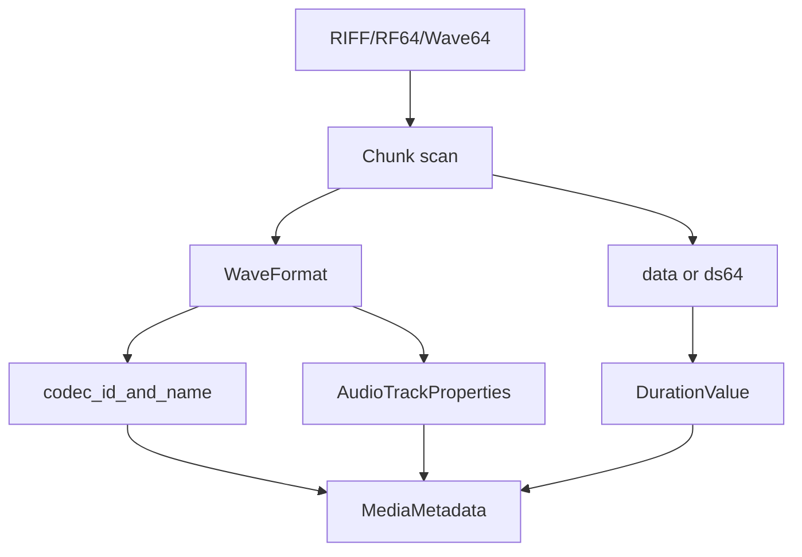

# WAV / RF64 / Wave64 Parser

Implementation progress: 92%

## Purpose

The WAV parser recognises RIFF/WAVE, RF64, and Wave64 files. It extracts WAVEFORMATEX or WAVEFORMATEXTENSIBLE audio properties and supports PCM, IEEE float, AC-3-in-WAV, and DTS-in-WAV identification.

## Implementation

- Primary implementation: `src-tauri/src/media_metadata/audio/wav.rs`
- Upstream basis: `../mkvtoolnix/src/input/r_wav.cpp`, `../mkvtoolnix/src/input/r_wav.h`, plus upstream Wave64 helpers

The parser detects the wrapper type, scans chunks, parses `fmt `, reads RF64 `ds64` where present, detects Wave64 GUID chunks, and derives duration from data size and block alignment. The payload byte total **sums the lengths of every `data` chunk** (mirroring `scan_chunks_wave`'s `m_bytes_in_data_chunks += new_chunk.len`); RF64 overrides the total with the `ds64` `data_size`. The AC-3/DTS payload sniffers probe the first data chunk (matching `find_chunk("data", 0, false)` plus the demuxer probe at that position) and promote AC-3 and DTS-in-WAV streams to their corresponding codec IDs.

## Data Structures

Important structures are `WavType`, `WaveFormat`, `WavMetadata`, and internal chunk descriptors.

## Gaps and Handling

The byte total now accumulates all data chunks like upstream, so duration is correct for multi-`data`-chunk files. Upstream additionally has a >4 GB repair path that recalculates a single huge data chunk's length from the file size when a non-data chunk follows it (`scan_chunks_wave`'s `file_size > 0x100000000` branch); this header-only port relies on the file-size-bounded chunk walk instead, which is sufficient for identification. Unsupported format tags are reported through the structured model rather than matching mkvmerge's exact text output.
