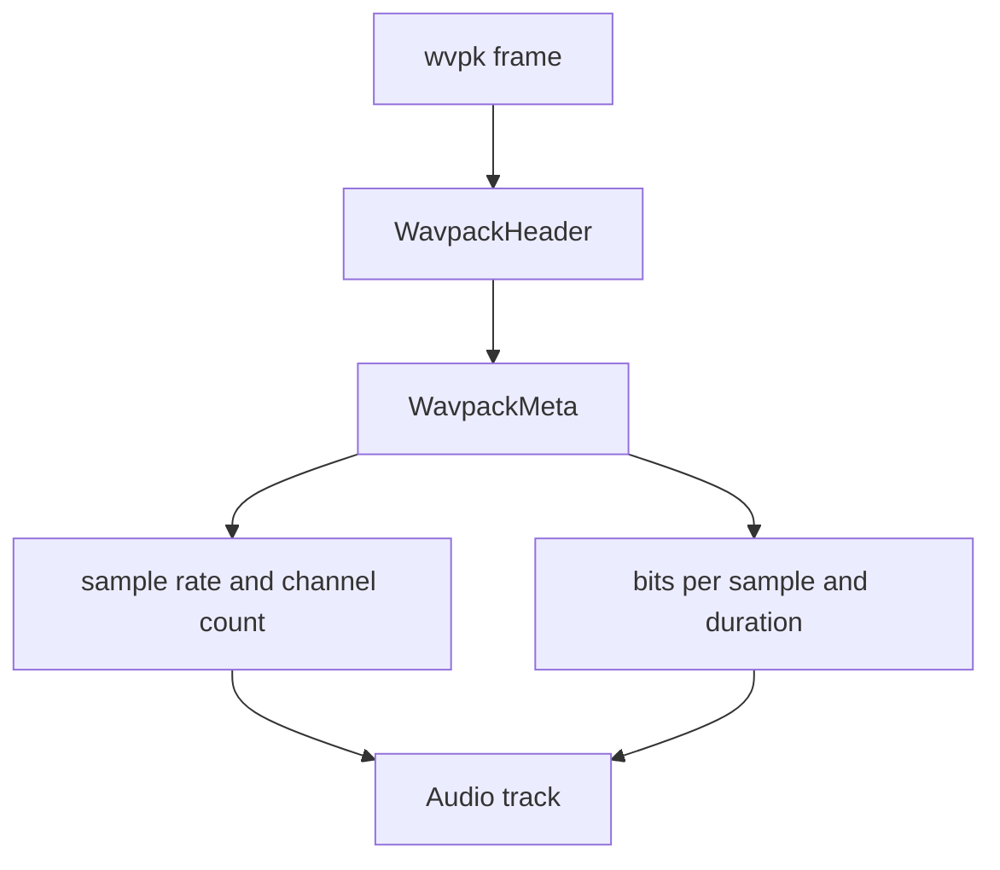

# WavPack Parser

Implementation progress: 90%

## Purpose

The WavPack parser recognises WavPack v4 streams and reports sample rate, channel count, bit depth, total-sample duration, and codec-private version metadata.

## Implementation

- Primary implementation: `src-tauri/src/media_metadata/audio/wavpack.rs`
- Upstream basis: `../mkvtoolnix/src/input/r_wavpack.cpp`, `../mkvtoolnix/src/input/r_wavpack.h`, `../mkvtoolnix/src/common/wavpack.cpp`, `../mkvtoolnix/src/common/wavpack.h`

The reader parses the `wvpk` frame header, validates v4 frame fields, gathers multichannel segment information, reads standard and nonstandard sample-rate metadata, applies DSD rate shifters, and derives duration when total samples are known.

## Data Structures

Core structures are `WavpackHeader` and `WavpackMeta`.

## Gaps and Handling

Upstream scans farther to resynchronise before the first header and can pair correction `.wvc` files for muxing. The Rust parser focuses on the primary `.wv` metadata path and does not retain correction-stream state, which is not surfaced in the UI.
