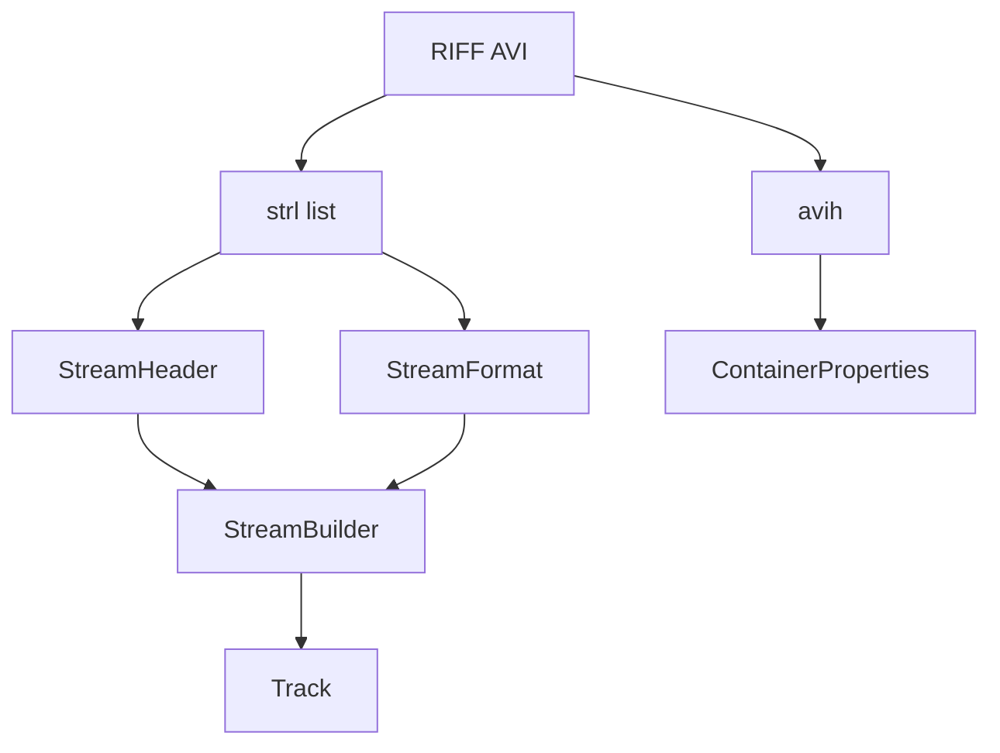

# AVI Parser

Implementation progress: 90%

## Purpose

The AVI parser recognises RIFF/AVI files and extracts container duration, dimensions, stream headers, video tracks, audio tracks, ODML frame counts, and limited embedded subtitle metadata.

## Implementation

- Primary implementation: `src-tauri/src/media_metadata/avi/reader.rs`
- Related modules: `src-tauri/src/media_metadata/avi/riff.rs`, `avih.rs`, `strl.rs`, `odml.rs`, `identify.rs`, `subtitles.rs`, `mpeg4_par.rs`
- Upstream basis: `../mkvtoolnix/src/input/r_avi.cpp`, `../mkvtoolnix/src/input/r_avi.h`, `../mkvtoolnix/src/common/mpeg4_p2.cpp`, `../mkvtoolnix/lib/avilib-0.6.10/*`

The reader walks RIFF chunks directly instead of using avilib. It accepts the top-level `RIFF` and `AVI ` form signatures case-insensitively, matching mkvtoolnix's lowercased probe path, while leaving child chunk dispatch on normal RIFF FOURCCs. It processes `LIST hdrl`, `avih`, one or more `LIST strl` entries, `strh`, `strf`, `vprp`, and ODML `dmlh`. The identify layer maps FOURCC and WAVE format tags into the shared track model.

Display dimensions come from `vprp`'s frame aspect ratio when present (`handle_video_aspect_ratio`). Otherwise, for an MPEG-4 Part 2 (DivX/Xvid) video track, the reader reads the first video frame from `movi` and decodes its Visual-Object-Layer header's `aspect_ratio_info` (`mpeg4_par.rs`, a port of `mtx::mpeg4_p2::extract_par`), then applies that bitstream pixel aspect ratio to the coded dimensions — mirroring `avi_reader_c::extended_identify_mpeg4_l2` (`r_avi.cpp:843-865`). The frame read is bounded (the first matching `NNdb`/`NNdc` chunk, capped at 256 KiB) so the header-only contract holds (PARSER-241).

GAB2 text chunks are classified as SRT or SSA/ASS; for SSA/ASS the embedded payload is re-parsed with the shared SSA parser to harvest `[Fonts]` / `[Graphics]` attachments, mirroring `avi_reader_c::identify_attachments` (`../mkvtoolnix/src/input/r_avi.cpp:942-959`). The harvested attachments are emitted globally with sequential ids in `finalise`.

The video track passes the same gate `avi_reader_c::verify_video_track` applies before identify (`r_avi.cpp:112-114`): the `BITMAPINFOHEADER` must be at least `sizeof(alBITMAPINFOHEADER)` (40 bytes) and both the sign-stripped width and height must be nonzero. A stream that fails any check is suppressed instead of emitting a false-positive video track (PARSER-273). Mirroring avilib, the first `vids` stream is bound as the single video track and consumes the video slot even when it fails verification, so a later video stream is never promoted in its place.

## Data Structures

Important structures are `ChunkHeader`, `MainAviHeader`, `StreamHeader`, `StreamFormat`, `BitmapInfoHeader`, `WaveFormatEx`, and `StreamBuilder`.

## Gaps and Handling

Upstream's avilib path handles full indexes, payload reads, timestamp work, packetizer verification, and richer codec checks. Rust does not parse payload indexes. The parser handles this by reporting reliable header metadata and keeping muxing-derived state out of scope. MPEG-4 Part 2 frame PAR is now extracted from a bounded first-frame read; only the VOL header's `aspect_ratio_info` is decoded (the rest of the frame is not). The video-track verification gate matches `verify_video_track`, so malformed bitmap headers no longer produce false-positive video tracks. Top-level RIFF/Form magic checks are case-insensitive like mkvtoolnix.

## Open Issues

- PARSER-311: `WAVE_FORMAT_EXTENSIBLE` audio is resolved from partial, truncated extension data. `parse_waveformatex` clamps `cbSize` to the available bytes and `make_audio_track` unwraps the SubFormat GUID when only ten extra bytes are present, reading only the low 16 bits of GUID `data1`. mkvtoolnix only unwraps `0xfffe` when the declared extension is at least `sizeof(alWAVEFORMATEXTENSION)`, then reads the full 32-bit GUID `data1`. Malformed or nonstandard extensible headers can therefore be repaired or truncated into the wrong codec tag.
- PARSER-312: Video codec private data does not preserve the full original `BITMAPINFOHEADER`. `parse_bitmapinfoheader` discards bytes 24..40 and `bmih_codec_private` writes those fields back as zeroes, while mkvtoolnix clones the original 40-byte `alBITMAPINFOHEADER` plus extradata. Any AVI whose x/y pixels-per-meter or color-table fields are nonzero is mutated by the native parser instead of reported as-is.
