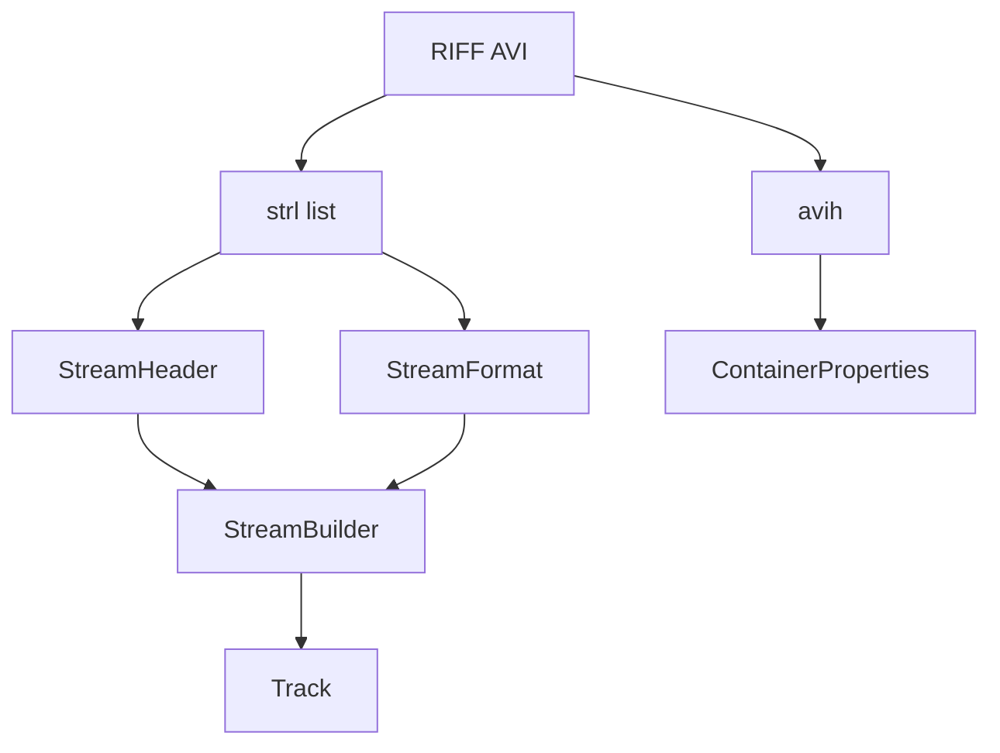

# AVI Parser

Implementation progress: 80%

## Purpose

The AVI parser recognises RIFF/AVI files and extracts container duration, dimensions, stream headers, video tracks, audio tracks, ODML frame counts, and limited embedded subtitle metadata.

## Implementation

- Primary implementation: `src-tauri/src/media_metadata/avi/reader.rs`
- Related modules: `src-tauri/src/media_metadata/avi/riff.rs`, `avih.rs`, `strl.rs`, `odml.rs`, `identify.rs`, `subtitles.rs`
- Upstream basis: `../mkvtoolnix/src/input/r_avi.cpp`, `../mkvtoolnix/src/input/r_avi.h`, `../mkvtoolnix/lib/avilib-0.6.10/*`

The reader walks RIFF chunks directly instead of using avilib. It processes `LIST hdrl`, `avih`, one or more `LIST strl` entries, `strh`, `strf`, `vprp`, and ODML `dmlh`. The identify layer maps FOURCC and WAVE format tags into the shared track model.

GAB2 text chunks are classified as SRT or SSA/ASS; for SSA/ASS the embedded payload is re-parsed with the shared SSA parser to harvest `[Fonts]` / `[Graphics]` attachments, mirroring `avi_reader_c::identify_attachments` (`../mkvtoolnix/src/input/r_avi.cpp:942-959`). The harvested attachments are emitted globally with sequential ids in `finalise`.

## Data Structures

Important structures are `ChunkHeader`, `MainAviHeader`, `StreamHeader`, `StreamFormat`, `BitmapInfoHeader`, `WaveFormatEx`, and `StreamBuilder`.

## Gaps and Handling

Upstream's avilib path handles full indexes, payload reads, timestamp work, packetizer verification, and richer codec checks. Rust does not parse payload indexes or extract MPEG-4 pixel aspect ratio from frames. The parser handles this by reporting reliable header metadata and keeping muxing-derived state out of scope.

## Open Issues

### PARSER-241: MPEG-4 Part 2 frame PAR is not used for identify display dimensions

The native AVI path derives display dimensions from `vprp` when present, but it never reads the first MPEG-4 Part 2 video frame to extract the VOL pixel aspect ratio. mkvmerge's AVI identify path calls `extended_identify_mpeg4_l2`, reads frame 0, runs `mtx::mpeg4_p2::extract_par`, and reports adjusted display dimensions from that bitstream PAR. As a result, an AVI with DivX/Xvid PAR in the first frame and no `vprp` still reports square-pixel display dimensions natively while mkvmerge reports the anamorphic display size.
