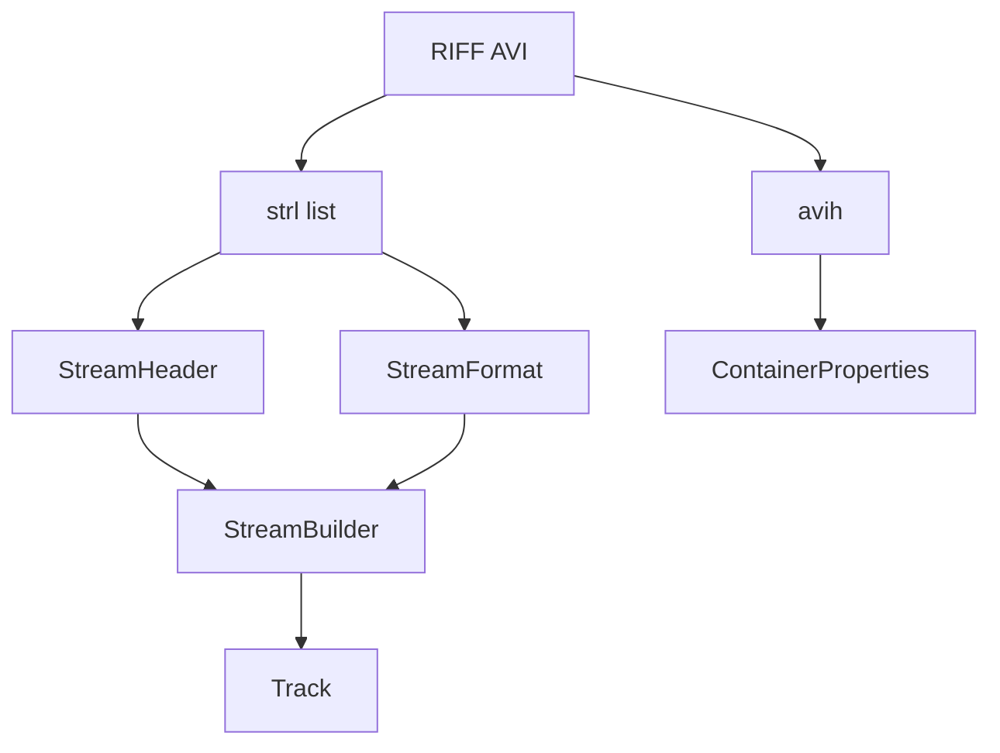

# AVI Parser

Implementation progress: 76%

## Purpose

The AVI parser recognises RIFF/AVI files and extracts container duration, dimensions, stream headers, video tracks, audio tracks, ODML frame counts, and limited embedded subtitle metadata.

## Implementation

- Primary implementation: `src-tauri/src/media_metadata/avi/reader.rs`
- Related modules: `src-tauri/src/media_metadata/avi/riff.rs`, `avih.rs`, `strl.rs`, `odml.rs`, `identify.rs`, `subtitles.rs`
- Upstream basis: `../mkvtoolnix/src/input/r_avi.cpp`, `../mkvtoolnix/src/input/r_avi.h`, `../mkvtoolnix/lib/avilib-0.6.10/*`

The reader walks RIFF chunks directly instead of using avilib. It processes `LIST hdrl`, `avih`, one or more `LIST strl` entries, `strh`, `strf`, `vprp`, and ODML `dmlh`. The identify layer maps FOURCC and WAVE format tags into the shared track model.

## Data Structures

Important structures are `ChunkHeader`, `MainAviHeader`, `StreamHeader`, `StreamFormat`, `BitmapInfoHeader`, `WaveFormatEx`, and `StreamBuilder`.

## Gaps and Handling

Upstream's avilib path handles full indexes, payload reads, timestamp work, packetizer verification, and richer codec checks. Rust does not parse payload indexes or extract MPEG-4 pixel aspect ratio from frames, and embedded SSA attachment extraction is not complete. The parser handles this by reporting reliable header metadata and keeping muxing-derived state out of scope.
