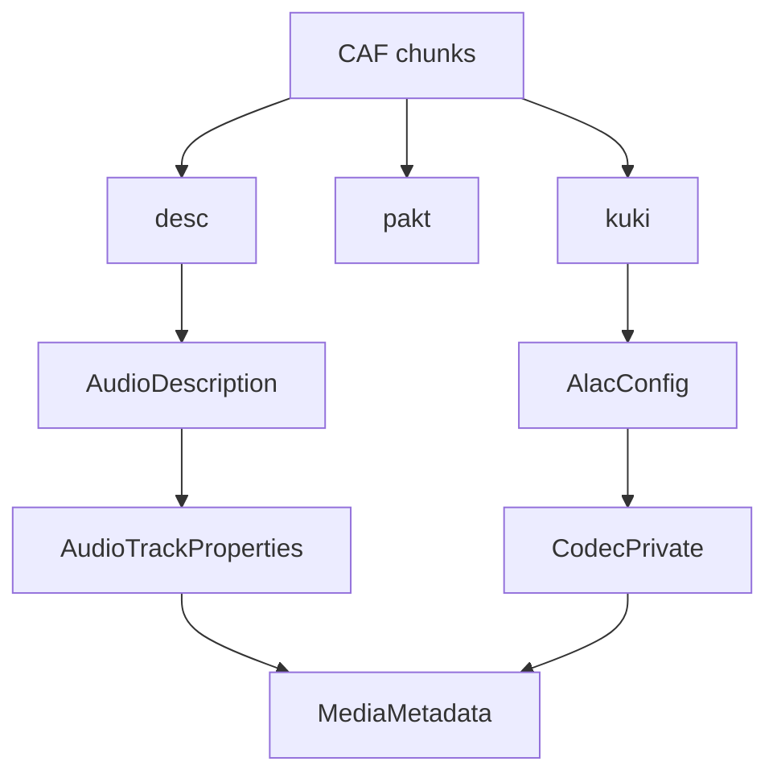

# CoreAudio CAF Parser

Implementation progress: 100%

## Purpose

The CoreAudio parser recognises CAF files and reports audio metadata, with full supported-track handling for ALAC. Non-ALAC CAF files are recognised but exposed as unsupported, matching mkvtoolnix's container-level identification behavior.

## Implementation

- Primary implementation: `src-tauri/src/media_metadata/coreaudio/reader.rs`
- CAF helpers: `src-tauri/src/media_metadata/coreaudio/caf.rs`
- Upstream basis: `../mkvtoolnix/src/input/r_coreaudio.cpp`, `../mkvtoolnix/src/input/r_coreaudio.h`

The reader checks the `caff` magic case-insensitively, scans CAF chunks with mkvtoolnix's size handling until EOF/truncation or the parser deadline, requires `desc`, `pakt`, and `data`, uses `pakt` for duration, and converts `kuki` ALAC magic cookies into the codec-private form used by Matroska-oriented metadata. A declared CAF chunk size of `0` is treated as a file-sized chunk like upstream, so exact reads from the post-header data position fail instead of repairing malformed required chunks. Required chunk bodies are read at their declared size with no CAF-local chunk-count or body-size cap; chunks whose declared body extends past EOF fail header parsing instead of being repaired. When a present ALAC `kuki` chunk is too short or carries a truncated old-style `frmaalac` wrapper, header parsing fails as malformed instead of silently dropping codec private data. `caf.rs` contains the chunk-level structures and ALAC cookie conversion.

## Data Structures

Key structures are `Chunk`, `AudioDescription`, `CafMetadata`, and `AlacConfig`.

## Gaps and Handling

Packet tables are used for header-derived duration and validation but are not retained for packet delivery. Codec naming follows the app model rather than mkvmerge's exact codec lookup display strings.

## Open Issues

- `PARSER-358` - Non-zero CAF chunk sizes are not clamped to the file length before required chunk bodies are allocated and read. `scan_chunks` keeps the declared size, while mkvtoolnix caps each chunk size with the file size before `read_chunk`; a malformed `desc`, `pakt`, or `kuki` size can therefore trigger a huge allocation/panic locally instead of a bounded header-parse failure.
