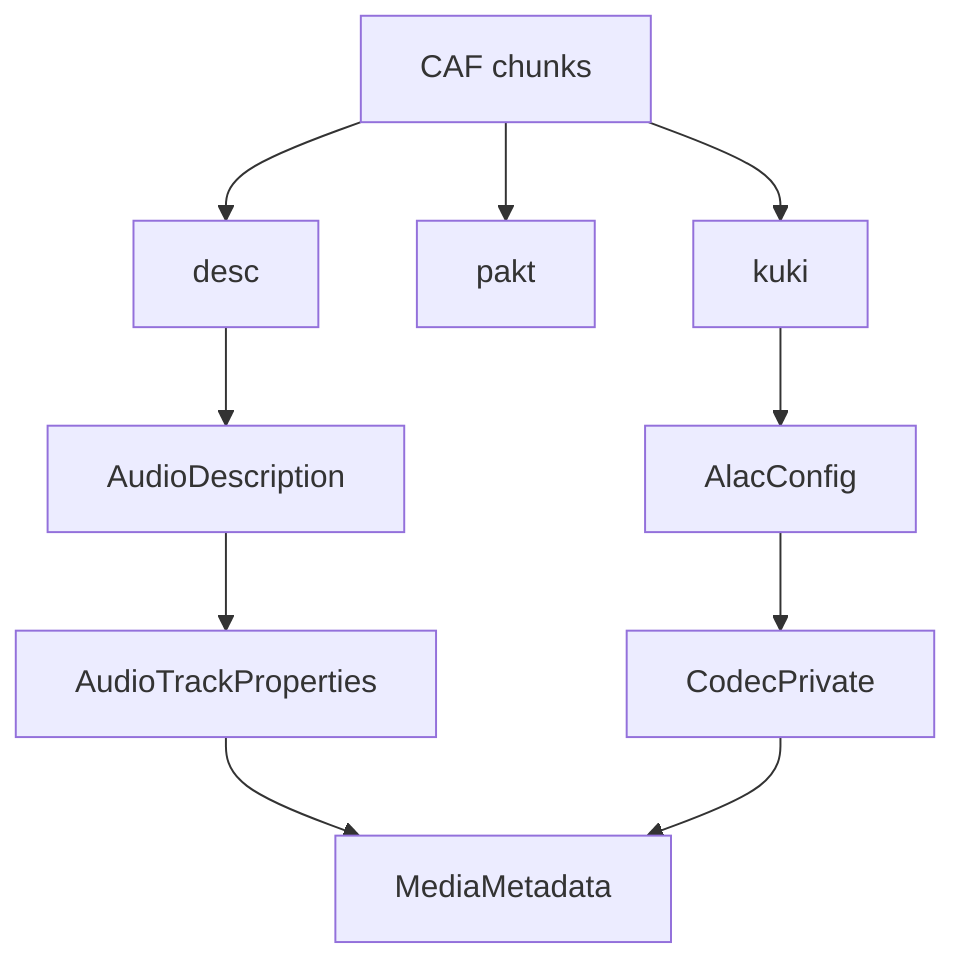

# CoreAudio CAF Parser

Implementation progress: 100%

## Purpose

The CoreAudio parser recognises CAF files and reports audio metadata, with full supported-track handling for ALAC. Non-ALAC CAF files are recognised but exposed as unsupported, matching mkvtoolnix's container-level identification behavior.

## Implementation

- Primary implementation: `src-tauri/src/media_metadata/coreaudio/reader.rs`
- CAF helpers: `src-tauri/src/media_metadata/coreaudio/caf.rs`
- Upstream basis: `../mkvtoolnix/src/input/r_coreaudio.cpp`, `../mkvtoolnix/src/input/r_coreaudio.h`

The reader checks the `caff` magic case-insensitively, scans CAF chunks with mkvtoolnix's size handling, requires `desc`, `pakt`, and `data`, uses `pakt` for duration, and converts `kuki` ALAC magic cookies into the codec-private form used by Matroska-oriented metadata. A declared CAF chunk size of `0` is treated as a file-sized chunk like upstream, so exact reads from the post-header data position fail instead of repairing malformed required chunks. Required chunk bodies are read exactly: chunks over the bounded read cap and chunks whose declared body extends past EOF fail header parsing instead of being repaired. When a present ALAC `kuki` chunk is too short or carries a truncated old-style `frmaalac` wrapper, header parsing fails as malformed instead of silently dropping codec private data. `caf.rs` contains the chunk-level structures and ALAC cookie conversion.

## Data Structures

Key structures are `Chunk`, `AudioDescription`, `CafMetadata`, and `AlacConfig`.

## Gaps and Handling

Packet tables are used for header-derived duration and validation but are not retained for packet delivery. Codec naming follows the app model rather than mkvmerge's exact codec lookup display strings.

## Open Issues

### PARSER-324: CAF chunk scanning and required body reads have artificial caps

`reader.rs` still stops `scan_chunks` after `MAX_CHUNKS = 4096`, even though the module contract says CAF chunks are scanned through the whole file so `desc`, `pakt`, and `kuki` are found regardless of position. It also rejects any required chunk body above `MAX_CHUNK_READ = 16 MiB`. Upstream `coreaudio_reader_c::scan_chunks` loops until EOF or an I/O exception and `read_chunk` allocates and reads the selected chunk's exact declared size; there is no CAF-local chunk-count cap or 16 MiB body cap.

A CAF with many small chunks before `desc`/`pakt`/`kuki`, or with a large but readable `pakt`/`kuki` body, can therefore be reported malformed/oversized by the Rust parser while mkvtoolnix accepts it. The bounded behavior should come from deadline checks and exact declared-size reads, not from fixed per-format limits that drop reachable header chunks.
