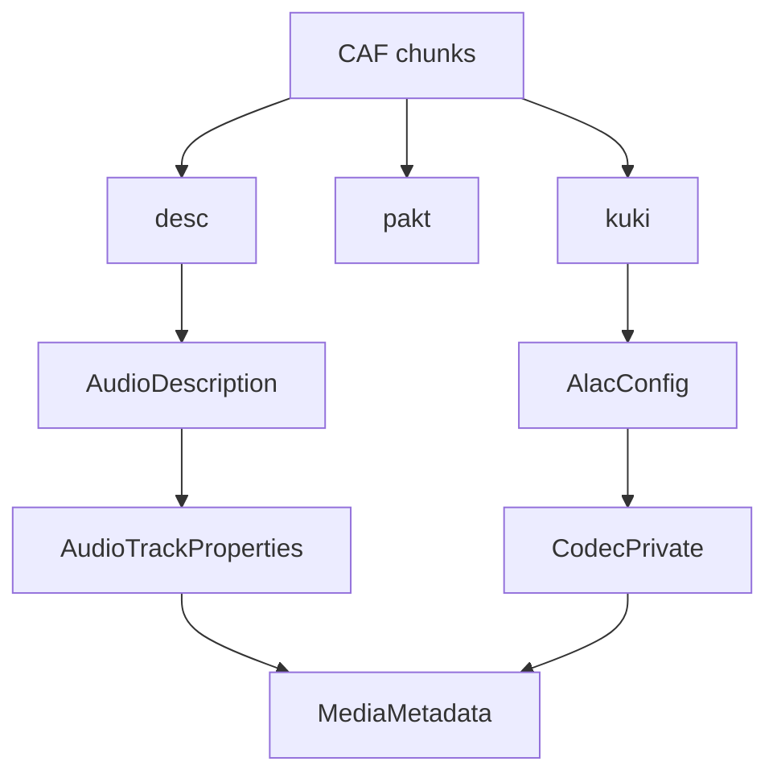

# CoreAudio CAF Parser

Implementation progress: 90%

## Purpose

The CoreAudio parser recognises CAF files and reports audio metadata, with full supported-track handling for ALAC. Non-ALAC CAF files are recognised but exposed as unsupported when the app cannot produce useful track metadata.

## Implementation

- Primary implementation: `src-tauri/src/media_metadata/coreaudio/reader.rs`
- CAF helpers: `src-tauri/src/media_metadata/coreaudio/caf.rs`
- Upstream basis: `../mkvtoolnix/src/input/r_coreaudio.cpp`, `../mkvtoolnix/src/input/r_coreaudio.h`

The reader checks `caff`, scans CAF chunks, parses `desc`, uses `pakt` for duration when available, and converts `kuki` ALAC magic cookies into the codec-private form used by Matroska-oriented metadata. `caf.rs` contains the chunk-level structures and ALAC cookie conversion.

## Data Structures

Key structures are `Chunk`, `AudioDescription`, `CafMetadata`, and `AlacConfig`.

## Gaps and Handling

The upstream reader effectively requires packet-table information for packet delivery; Rust treats `pakt` as optional for metadata and only uses it for duration. Packet tables are not retained. Codec naming follows the app model rather than mkvmerge's exact codec lookup display strings.

## Open Issues

### PARSER-280 - CAF magic comparison is case-sensitive

`probe` and `read_headers` compare the first four bytes exactly to `b"caff"`. mkvtoolnix lowercases the four-byte magic before comparing it with `"caff"`.

Impact: CAF files beginning with `CAFF` or another ASCII-case variant are accepted by mkvtoolnix but rejected by Rust before chunk parsing.

Fix direction: use ASCII-case-insensitive magic checks in both `probe` and `read_headers`.

### PARSER-281 - CAF identifies files without required `pakt` / `data` chunks

Rust treats `pakt` as optional and never requires a `data` chunk. mkvtoolnix's `read_headers` always calls `parse_pakt_chunk`; that reads the required `pakt` chunk and then calls `find_chunk("data")`, which throws when the `data` chunk is missing.

Impact: Rust can recognize unsupported or ALAC CAF files that mkvtoolnix fails during header parsing, and it can emit an ALAC track without the packet table/data relationship upstream requires for packet delivery.

Fix direction: require the `pakt` chunk and the `data` chunk during CAF header parsing, matching mkvtoolnix's `parse_desc_chunk -> parse_pakt_chunk -> parse_kuki_chunk` order.

### PARSER-285 - Invalid ALAC `kuki` chunks are silently ignored

When an ALAC `kuki` chunk exists, Rust calls `convert_alac_cookie` and simply leaves `codec_private` empty if the cookie is too short or an old-style `frmaalac` wrapper is truncated. mkvtoolnix treats those cases as header parsing errors in `handle_alac_magic_cookie`.

Impact: Corrupt ALAC CAF files with a present but invalid magic cookie are still identified by Rust, often as playable-looking ALAC without codec private data, while mkvtoolnix rejects the headers.

Fix direction: keep `kuki` optional for ALAC, but when it is present, fail malformed/truncated cookies instead of dropping them silently.
