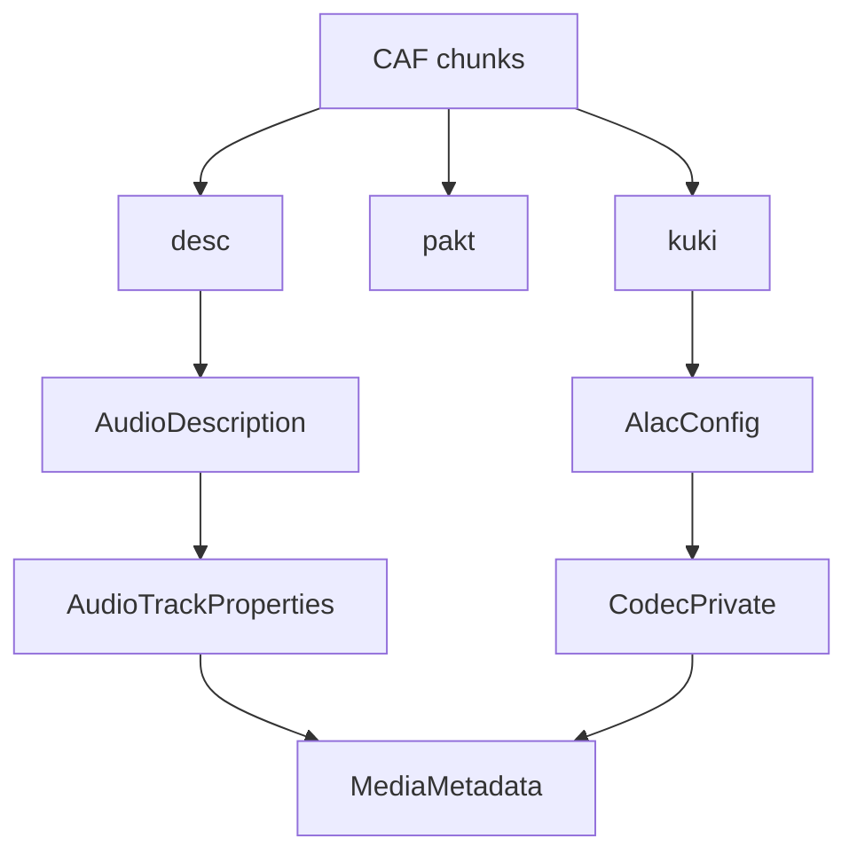

# CoreAudio CAF Parser

Implementation progress: 90%

## Purpose

The CoreAudio parser recognises CAF files and reports audio metadata, with full supported-track handling for ALAC. Non-ALAC CAF files are recognised but exposed as unsupported when the app cannot produce useful track metadata.

## Implementation

- Primary implementation: `src-tauri/src/media_metadata/coreaudio/reader.rs`
- CAF helpers: `src-tauri/src/media_metadata/coreaudio/caf.rs`
- Upstream basis: `../mkvtoolnix/src/input/r_coreaudio.cpp`, `../mkvtoolnix/src/input/r_coreaudio.h`

The reader checks `caff`, scans CAF chunks, parses `desc`, uses `pakt` for duration when available, and converts `kuki` ALAC magic cookies into the codec-private form used by Matroska-oriented metadata. `caf.rs` contains the chunk-level structures and ALAC cookie conversion.

## Data Structures

Key structures are `Chunk`, `AudioDescription`, `CafMetadata`, and `AlacConfig`.

## Gaps and Handling

The upstream reader effectively requires packet-table information for packet delivery; Rust treats `pakt` as optional for metadata and only uses it for duration. Packet tables are not retained. Codec naming follows the app model rather than mkvmerge's exact codec lookup display strings.
