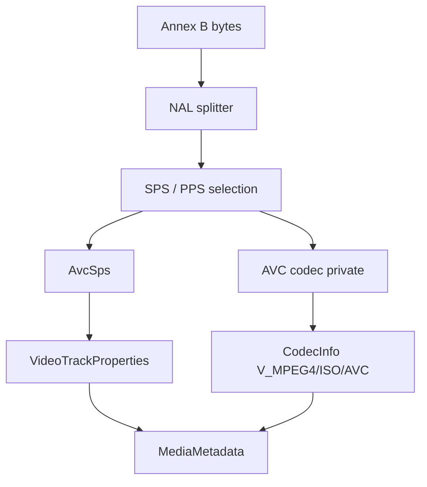

# AVC / H.264 Elementary Stream Parser

Implementation progress: 86%

## Purpose

The AVC parser recognises raw Annex B H.264 elementary streams and reports one video track with dimensions, display dimensions, profile, level, chroma format, bit depth, optional VUI-derived frame duration, and AVC decoder configuration bytes.

## Implementation

- Primary implementation: `src-tauri/src/media_metadata/elementary/avc/reader.rs`
- Helpers: `src-tauri/src/media_metadata/elementary/avc/nal.rs`, `src-tauri/src/media_metadata/elementary/avc/sps.rs`
- Upstream basis: `../mkvtoolnix/src/input/r_avc.cpp`, `../mkvtoolnix/src/input/r_avc.h`, `../mkvtoolnix/src/common/avc/*`, `../mkvtoolnix/src/common/xyzvc/*`

The reader scans a bounded prefix for Annex B start codes, splits NAL units, requires SPS and PPS, strips emulation-prevention bytes, parses the SPS RBSP, and builds AVCDecoderConfigurationRecord-style codec private data.

The SPS VUI is decoded for both the sample aspect ratio and frame timing. The PAR is read from `aspect_ratio_idc` (the predefined `s_predefined_pars` table) or the `EXTENDED_SAR` (255) explicit 16-bit numerator/denominator, and `AvcSps::display_dimensions` applies it to the cropped pixel dimensions exactly as `es_parser_c::get_display_dimensions` does (PAR ≥ 1 stretches width, PAR < 1 stretches height); with no usable PAR the display dimensions equal the cropped pixel dimensions. The VUI frame duration is `num_units_in_tick * 1e9 / time_scale`, matching `timing_info_t::default_duration()` (no factor of two).

## Data Structures

Key structures are `NalUnit`, `AvcSps`, and the internal `AvcHeaders` bundle.

## Gaps and Handling

Upstream can scan much farther and uses a fuller elementary-stream parser with slice/access-unit state and `might_be_xyzvc` guards. Rust scans the first 64 KiB and focuses on SPS/PPS metadata. The PAR and VUI default-duration are now derived to match mkvmerge; what remains out of scope is the muxing-time "most often used duration" heuristic (which corrects field/frame-rate conventions from actual frame timestamps) — header-only identification reports the SPS-declared value directly.

## Open Issues

### PARSER-257 - Elementary AVC avcC codec private drops the SPS profile-compatibility byte

`src-tauri/src/media_metadata/elementary/avc/sps.rs::parse` reads the SPS constraint/profile-compatibility byte into `_constraints` and discards it. `src-tauri/src/media_metadata/elementary/avc/reader.rs::AvcHeaders::codec_private` then writes AVCDecoderConfigurationRecord byte 2 as `0`.

`../mkvtoolnix/src/common/avc/util.cpp` stores that byte as `sps.profile_compat`, and `../mkvtoolnix/src/common/avc/avcc.cpp::pack` writes it into the generated avcC record when no container override exists. Rust therefore loses constraint-set / compatibility flags from raw Annex B AVC streams in both `codec_private` and `raw_hex`.
