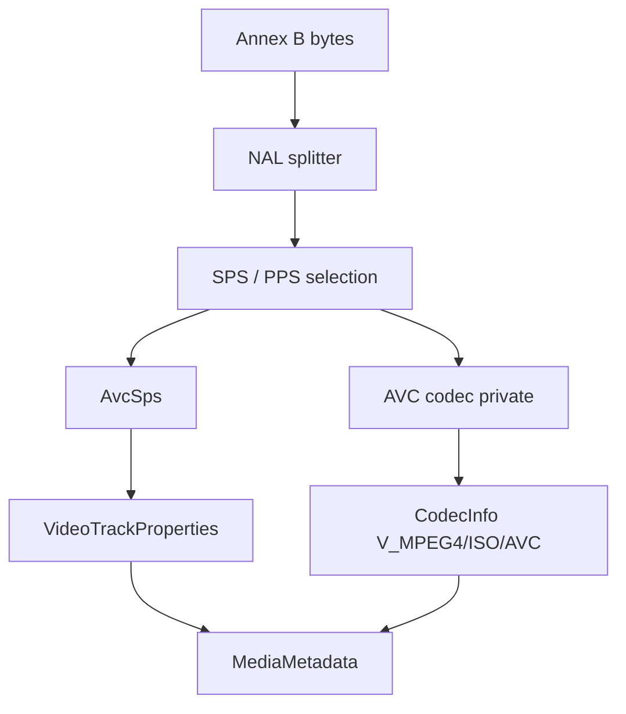

# AVC / H.264 Elementary Stream Parser

Implementation progress: 92%

## Purpose

The AVC parser recognises raw Annex B H.264 elementary streams and reports one video track with dimensions, display dimensions, profile, level, chroma format, bit depth, optional VUI-derived frame duration, and AVC decoder configuration bytes.

## Implementation

- Primary implementation: `src-tauri/src/media_metadata/elementary/avc/reader.rs`
- Helpers: `src-tauri/src/media_metadata/elementary/avc/nal.rs`, `src-tauri/src/media_metadata/elementary/avc/sps.rs`
- Upstream basis: `../mkvtoolnix/src/input/r_avc.cpp`, `../mkvtoolnix/src/input/r_avc.h`, `../mkvtoolnix/src/common/avc/*`, `../mkvtoolnix/src/common/xyzvc/*`

The reader scans a bounded prefix for Annex B start codes in 1 MiB chunks, up to the same fifty chunks mkvtoolnix feeds into its AVC elementary-stream parser. `read_headers` checks the configured parser deadline between chunks. The raw probe rejects a first probe byte of `0x47` to avoid claiming MPEG-TS sync-prefixed data, matching mkvtoolnix's `might_be_xyzvc` guard. The scan splits NAL units, requires SPS, PPS, and access-unit evidence (slice, IDR slice, or AUD), strips emulation-prevention bytes, parses the SPS RBSP, rejects SPS entries whose cropped dimensions are zero, and builds AVCDecoderConfigurationRecord-style codec private data. The SPS constraint-set / profile-compatibility byte (`rbsp[1]`) is captured as `AvcSps::profile_compat` and written verbatim into avcC byte 2, mirroring `buffer[2] = sps.profile_compat` in `../mkvtoolnix/src/common/avc/avcc.cpp::pack`.

The SPS VUI is decoded for both the sample aspect ratio and frame timing. The PAR is read from `aspect_ratio_idc` (the predefined `s_predefined_pars` table) or the `EXTENDED_SAR` (255) explicit 16-bit numerator/denominator, and `AvcSps::display_dimensions` applies it to the cropped pixel dimensions exactly as `es_parser_c::get_display_dimensions` does (PAR ≥ 1 stretches width, PAR < 1 stretches height); with no usable PAR the display dimensions equal the cropped pixel dimensions. The VUI frame duration is `num_units_in_tick * 1e9 / time_scale`, matching `timing_info_t::default_duration()` (no factor of two). Malformed or truncated VUI data now invalidates the SPS instead of being silently defaulted away.

## Data Structures

Key structures are `NalUnit`, `AvcSps`, and the internal `AvcHeaders` bundle.

## Gaps and Handling

Upstream uses a fuller elementary-stream parser with broader access-unit validation. Rust now uses the same bounded chunk horizon and MPEG-TS first-byte guard for header discovery and requires parameter sets plus basic access-unit evidence before accepting a raw stream. The PAR and VUI default-duration are derived to match mkvmerge; what remains out of scope is the muxing-time "most often used duration" heuristic (which corrects field/frame-rate conventions from actual frame timestamps) — header-only identification reports the SPS-declared value directly.

## Open Issues

- `PARSER-350` - The current access-unit evidence gate does not match `mtx::avc::es_parser_c::headers_parsed()`. It treats an AUD NAL as sufficient after SPS/PPS even though upstream AUD handling only flushes an existing frame, and it misses some upstream evidence paths such as data-partition slice NALs and non-filler default-branch NALs that set the configuration record ready. Raw AVC, MPEG-TS AVC enrichment/sniffing, and MPEG-PS AVC promotion can therefore accept SPS/PPS/AUD-only data or reject SPS/PPS plus valid non-AUD evidence differently from mkvtoolnix.
