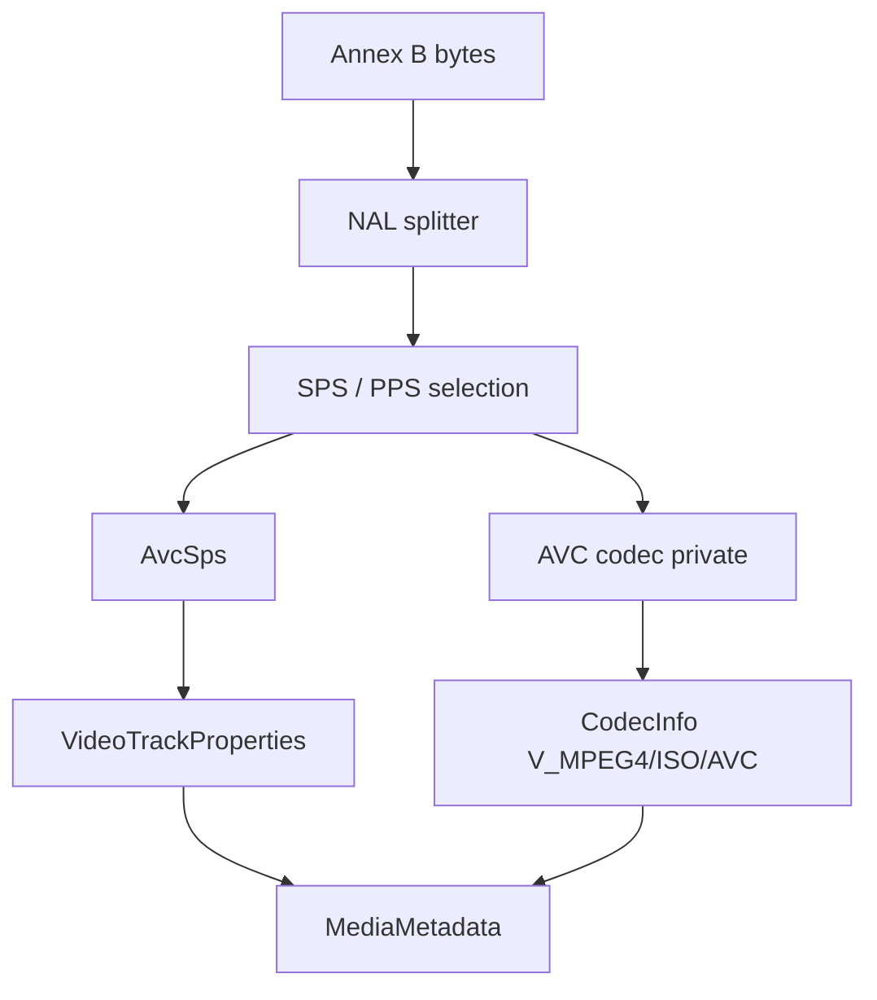

# AVC / H.264 Elementary Stream Parser

Implementation progress: 89%

## Purpose

The AVC parser recognises raw Annex B H.264 elementary streams and reports one video track with dimensions, display dimensions, profile, level, chroma format, bit depth, optional VUI-derived frame duration, and AVC decoder configuration bytes.

## Implementation

- Primary implementation: `src-tauri/src/media_metadata/elementary/avc/reader.rs`
- Helpers: `src-tauri/src/media_metadata/elementary/avc/nal.rs`, `src-tauri/src/media_metadata/elementary/avc/sps.rs`
- Upstream basis: `../mkvtoolnix/src/input/r_avc.cpp`, `../mkvtoolnix/src/input/r_avc.h`, `../mkvtoolnix/src/common/avc/*`, `../mkvtoolnix/src/common/xyzvc/*`

The reader scans a bounded prefix for Annex B start codes in 1 MiB chunks, up to the same fifty chunks mkvtoolnix feeds into its AVC elementary-stream parser. `read_headers` checks the configured parser deadline between chunks. The scan splits NAL units, requires SPS and PPS, strips emulation-prevention bytes, parses the SPS RBSP, and builds AVCDecoderConfigurationRecord-style codec private data. The SPS constraint-set / profile-compatibility byte (`rbsp[1]`) is captured as `AvcSps::profile_compat` and written verbatim into avcC byte 2, mirroring `buffer[2] = sps.profile_compat` in `../mkvtoolnix/src/common/avc/avcc.cpp::pack`.

The SPS VUI is decoded for both the sample aspect ratio and frame timing. The PAR is read from `aspect_ratio_idc` (the predefined `s_predefined_pars` table) or the `EXTENDED_SAR` (255) explicit 16-bit numerator/denominator, and `AvcSps::display_dimensions` applies it to the cropped pixel dimensions exactly as `es_parser_c::get_display_dimensions` does (PAR ≥ 1 stretches width, PAR < 1 stretches height); with no usable PAR the display dimensions equal the cropped pixel dimensions. The VUI frame duration is `num_units_in_tick * 1e9 / time_scale`, matching `timing_info_t::default_duration()` (no factor of two).

## Data Structures

Key structures are `NalUnit`, `AvcSps`, and the internal `AvcHeaders` bundle.

## Gaps and Handling

Upstream uses a fuller elementary-stream parser with slice/access-unit state and `might_be_xyzvc` guards. Rust now uses the same bounded chunk horizon for header discovery but still focuses on SPS/PPS metadata rather than access-unit validation. The PAR and VUI default-duration are derived to match mkvmerge; what remains out of scope is the muxing-time "most often used duration" heuristic (which corrects field/frame-rate conventions from actual frame timestamps) — header-only identification reports the SPS-declared value directly.

## Open Issues

### PARSER-290: Over-cropping can produce accepted zero pixel dimensions

`sps.rs` computes cropped dimensions with `saturating_sub`, and `reader.rs` accepts any parsed SPS/PPS without checking that `display_width` and `display_height` are positive. A stream whose crop offsets erase the coded size can therefore be emitted as a zero-width or zero-height AVC track.

mkvtoolnix rejects raw AVC in `probe_file` after `headers_parsed()` if the parser's width or height is `<= 0`. The Rust parser should reject zero cropped dimensions instead of reporting a track with impossible dimensions.

### PARSER-291: Malformed SPS VUI tails are accepted by dropping the tail

When `vui_parameters_present_flag` is set, `sps.rs` calls `parse_vui(...).unwrap_or_default()`. If the VUI is truncated or malformed, the SPS parse still succeeds and the raw AVC reader can accept the stream with no PAR or timing metadata.

Upstream `parse_sps` wraps the whole SPS parse in one exception boundary; a short read in VUI handling returns an empty parsed SPS, so the elementary-stream parser does not treat that SPS as valid. The Rust reader should not repair malformed SPS tails by silently defaulting optional VUI fields.

### PARSER-292: Raw AVC probing misses mkvtoolnix's MPEG-TS first-byte guard

mkvtoolnix's raw AVC probe rejects the file immediately when the first byte of the first probe buffer is `0x47`, because MPEG-TS packets start with that sync byte. The Rust `AvcReader` scans the prefix for Annex B SPS/PPS units without this guard.

Normal dispatch tries MPEG-TS before raw AVC, but extension hints or direct reader use can still let raw AVC claim a TS-like file that upstream's raw AVC reader refuses.
