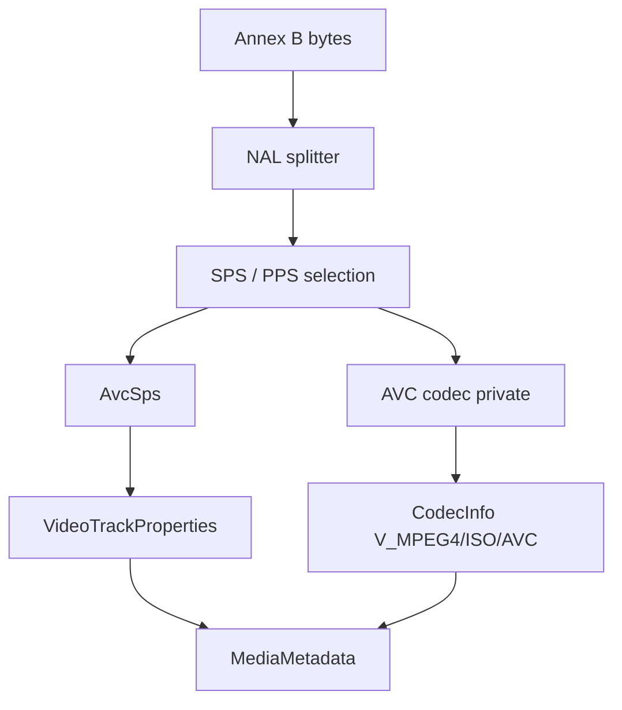

# AVC / H.264 Elementary Stream Parser

Implementation progress: 78%

## Purpose

The AVC parser recognises raw Annex B H.264 elementary streams and reports one video track with dimensions, display dimensions, profile, level, chroma format, bit depth, optional VUI-derived frame duration, and AVC decoder configuration bytes.

## Implementation

- Primary implementation: `src-tauri/src/media_metadata/elementary/avc/reader.rs`
- Helpers: `src-tauri/src/media_metadata/elementary/avc/nal.rs`, `src-tauri/src/media_metadata/elementary/avc/sps.rs`
- Upstream basis: `../mkvtoolnix/src/input/r_avc.cpp`, `../mkvtoolnix/src/input/r_avc.h`, `../mkvtoolnix/src/common/avc/*`, `../mkvtoolnix/src/common/xyzvc/*`

The reader scans a bounded prefix for Annex B start codes, splits NAL units, requires SPS and PPS, strips emulation-prevention bytes, parses the SPS RBSP, and builds AVCDecoderConfigurationRecord-style codec private data.

## Data Structures

Key structures are `NalUnit`, `AvcSps`, and the internal `AvcHeaders` bundle.

## Gaps and Handling

Upstream can scan much farther and uses a fuller elementary-stream parser with slice/access-unit state and `might_be_xyzvc` guards. Rust scans the first 64 KiB and focuses on SPS/PPS metadata. Pixel aspect ratio extraction and some upstream default-duration behavior are incomplete, so the parser reports only fields it can derive confidently from the SPS and VUI timing.

## Open Issues

- `PARSER-238`: Raw AVC VUI default-duration math is doubled relative to mkvmerge identify output. Native reports `2 * num_units_in_tick * 1e9 / time_scale`, while mkvmerge's `timing_info_t::default_duration()` and `r_avc.cpp::identify` report `num_units_in_tick * 1e9 / time_scale`.
- `PARSER-240`: AVC VUI sample aspect ratio is skipped and display dimensions are left equal to cropped pixel dimensions. mkvmerge extracts PAR from the AVC configuration record and sets display dimensions from the bitstream when no user override exists; native loses that header-level display metadata.
