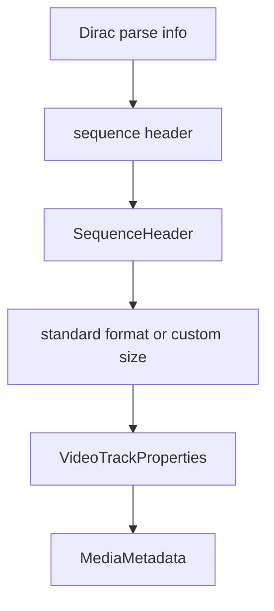

# Dirac Elementary Stream Parser

Implementation progress: 70%

## Purpose

The Dirac parser recognises raw Dirac streams, extracts sequence-header information, and reports one video track with codec identity and dimensions.

## Implementation

- Primary implementation: `src-tauri/src/media_metadata/elementary/dirac.rs`
- Upstream basis: `../mkvtoolnix/src/input/r_dirac.cpp`, `../mkvtoolnix/src/input/r_dirac.h`, upstream Dirac helper code under `../mkvtoolnix/src/common`

Mirroring `dirac_es_reader_c::probe_file`, the stream must *start* with the Dirac sync word (`BBCD`) before the parser runs; the parser then locates a sequence-header parse unit, decodes Dirac variable-length integers, handles custom dimensions, and maps a subset of standard video format indexes.

## Data Structures

The internal `SequenceHeader` contains width, height, interlace/progressive state, and optional default duration.

## Gaps and Handling

Upstream exposes more standard-format details such as frame rate, aspect ratio, clean area, top-field-first, and default duration. The probe now requires the stream to start with the Dirac sync word (matching upstream), then locates the sequence header within the prefix window and emits the stable dimensions it can decode.

## Open Issues

### PARSER-242: Dirac sequence headers lose standard-format timing, aspect, and clean-area fields

The native Dirac `SequenceHeader` keeps only width, height, and interlace state. mkvtoolnix's Dirac parser fills the full standard-video-format table, then applies custom frame-rate, aspect-ratio, clean-area, left/top-offset, and top-field-first overrides from the same sequence header; the packetizer uses those fields for display dimensions and default duration. Native also implements only a subset of the standard format indices, so formats such as 352x240, 704x480, 2048x1080, 4K, and 8K fall back to 640x480. This under-describes many valid Dirac elementary streams from header data that is already in scope.
