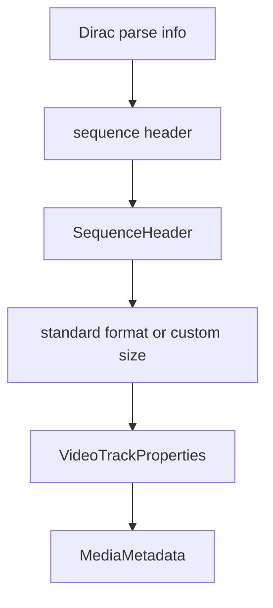

# Dirac Elementary Stream Parser

Implementation progress: 92%

## Purpose

The Dirac parser recognises raw Dirac streams, extracts sequence-header information, and reports one video track with codec identity and dimensions.

## Implementation

- Primary implementation: `src-tauri/src/media_metadata/elementary/dirac.rs`
- Upstream basis: `../mkvtoolnix/src/input/r_dirac.cpp`, `../mkvtoolnix/src/input/r_dirac.h`, upstream Dirac helper code under `../mkvtoolnix/src/common`

Mirroring `dirac_es_reader_c::probe_file`, the stream must *start* with the Dirac sync word (`BBCD`) before the parser runs; the parser then locates a sequence-header parse unit only after a later parse-info sync/`next_parse_offset` boundary proves the unit is complete, matching `mtx::dirac::es_parser_c` header availability (PARSER-360). Sequence-header payloads decode Dirac variable-length integers exactly as `mtx::dirac::parse_sequence_header` (`common/dirac.cpp`). The complete 23-entry standard-video-format table is implemented and indexed directly by `base_video_format` (out-of-range falls back to format 0), so 352x240, 704x480, 2048x1080, 4K, 8K, and 720x486 resolve correctly rather than collapsing to 640x480. Each standard format seeds frame rate, aspect ratio, interlace, and top-field-first, and the parser then applies the custom-source-dimension, chroma, scan, frame-rate (custom or `standard_frame_rates` index), aspect-ratio (custom or `standard_aspect_ratios` index), and clean-area overrides. The track reports display dimensions adjusted by the sample aspect ratio (`p_dirac.cpp` — scale width up when num > den, else scale height up) and a frame-rate-derived `default_duration_ns` (`1e9 * frame_rate_denominator / frame_rate_numerator`, `dirac.cpp:366-367`).

## Data Structures

The internal `SequenceHeader` contains pixel dimensions, interlace/top-field-first state, frame-rate numerator/denominator, and aspect-ratio numerator/denominator, with helpers for the aspect-adjusted display dimensions and frame-rate-derived default duration.

## Gaps and Handling

The clean-area width/height and left/top offsets are parsed for bit alignment but not surfaced, matching the packetizer, which derives display dimensions from the sample aspect ratio rather than the clean area. Granule-position timing reconstruction and packet muxing remain mkvmerge's concern.
