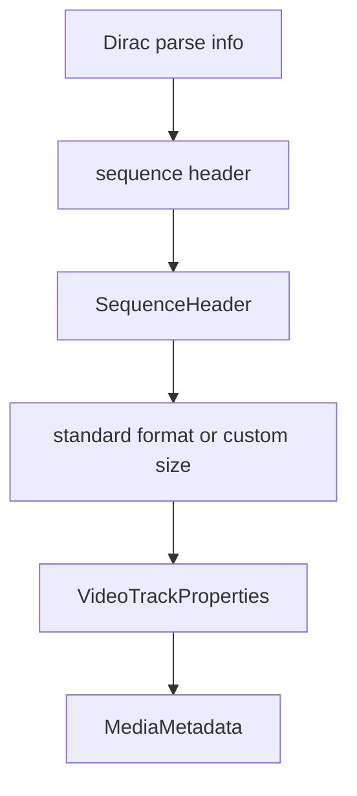

# Dirac Elementary Stream Parser

Implementation progress: 62%

## Purpose

The Dirac parser recognises raw Dirac streams, extracts sequence-header information, and reports one video track with codec identity and dimensions.

## Implementation

- Primary implementation: `src-tauri/src/media_metadata/elementary/dirac.rs`
- Upstream basis: `../mkvtoolnix/src/input/r_dirac.cpp`, `../mkvtoolnix/src/input/r_dirac.h`, upstream Dirac helper code under `../mkvtoolnix/src/common`

The parser looks for `BBCD` parse-info magic with a sequence-header parse code, decodes Dirac variable-length integers, handles custom dimensions, and maps a subset of standard video format indexes.

## Data Structures

The internal `SequenceHeader` contains width, height, interlace/progressive state, and optional default duration.

## Gaps and Handling

Upstream validates parse-unit chaining from the start of the stream and exposes more standard-format details such as frame rate, aspect ratio, clean area, top-field-first, and default duration. Rust accepts sequence headers found within the prefix window and emits the stable dimensions it can decode. This improves tolerance but can differ from mkvmerge's stricter probe behavior.
