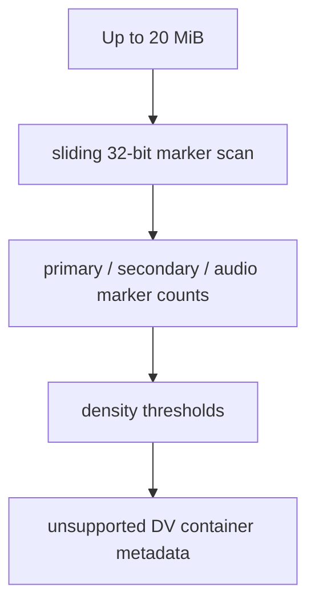

# DV Parser

Implementation progress: 60%

## Purpose

The DV parser recognises a narrow raw DV DIF header shape and reports the container as recognised but unsupported, matching mkvmerge's user-facing intent for raw DV streams.

## Implementation

- Primary implementation: `src-tauri/src/media_metadata/elementary/dv.rs`
- Upstream basis: `../mkvtoolnix/src/input/r_dv.cpp`, `../mkvtoolnix/src/input/r_dv.h`

The Rust implementation ports mkvtoolnix's FFmpeg-derived marker-density scan (`dv_reader_c::probe_file`): a sliding 32-bit big-endian window walks up to 20 MiB of the file counting primary DIF section markers (`0x1f07003f` with the channel/sequence bits masked off), secondary section markers, and the `0xff3f0701` audio-section marker that trails a `0x..3f0700` marker by exactly 80 bytes. DV is reported only when the marker density crosses the upstream thresholds (`matches > 4`, or `secondary_matches >= 10` with a tight average spacing). On a positive result it sets `ContainerFormat::Dv` with `supported = false` and emits no tracks.

## Data Structures

There are no persistent parser-specific structures; the reader writes directly into the container metadata.

## Gaps and Handling

The probe now mirrors upstream's marker-density scan over up to 20 MiB, so valid DV streams whose first header is not at offset 0 are recognised and short arbitrary files that merely begin with the `0x1f 0x07 0x00` prefix are rejected. The handling remains intentionally conservative after recognition: no track is emitted because raw DV extraction is not supported by this parser, so frame-rate, dimension, and aspect-ratio details that upstream surfaces for muxing are not decoded.
