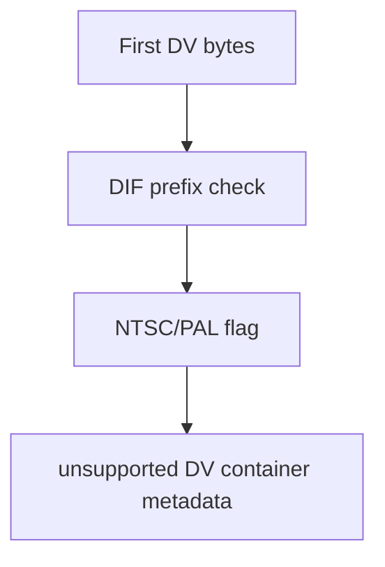

# DV Parser

Implementation progress: 45%

## Purpose

The DV parser recognises a narrow raw DV DIF header shape and reports the container as recognised but unsupported, matching mkvmerge's user-facing intent for raw DV streams.

## Implementation

- Primary implementation: `src-tauri/src/media_metadata/elementary/dv.rs`
- Upstream basis: `../mkvtoolnix/src/input/r_dv.cpp`, `../mkvtoolnix/src/input/r_dv.h`

The Rust implementation checks the leading DIF header prefix, derives the NTSC/PAL flag from the header byte, and sets `ContainerFormat::Dv` with `supported = false` and no tracks.

## Data Structures

There are no persistent parser-specific structures; the reader writes directly into the container metadata.

## Gaps and Handling

Upstream uses a broader FFmpeg-derived statistical scan over up to 20 MiB of DIF markers. Rust currently checks only the first few bytes, so valid DV streams can be missed and false positives are easier. The handling is intentionally conservative after recognition: no track is emitted because raw DV extraction is not supported by this parser.
