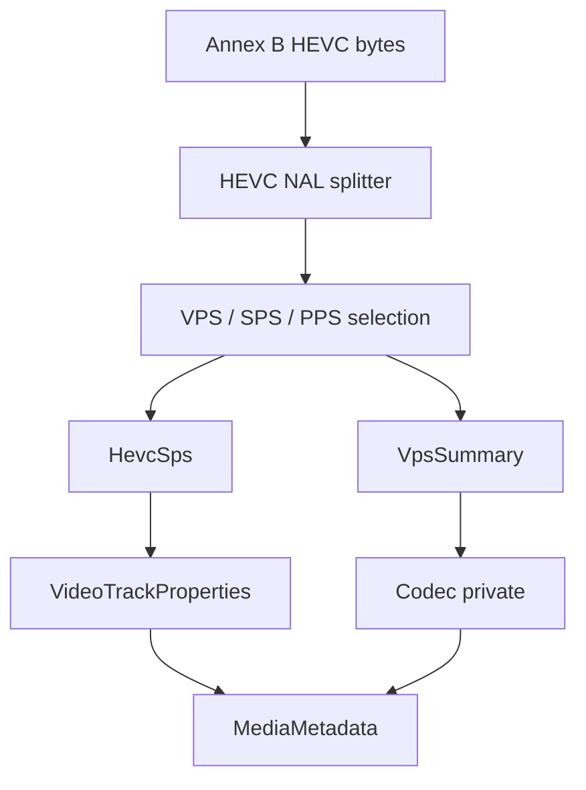

# HEVC / H.265 Elementary Stream Parser

Implementation progress: 84%

## Purpose

The HEVC parser recognises raw Annex B H.265 elementary streams and reports one video track with dimensions, profile, tier, level, chroma format, bit depth, VUI timing when available, and HEVC codec-private bytes.

## Implementation

- Primary implementation: `src-tauri/src/media_metadata/elementary/hevc/reader.rs`
- Helpers: `src-tauri/src/media_metadata/elementary/hevc/nal.rs`, `src-tauri/src/media_metadata/elementary/hevc/sps.rs`, `src-tauri/src/media_metadata/elementary/hevc/vps.rs`
- Upstream basis: `../mkvtoolnix/src/input/r_hevc.cpp`, `../mkvtoolnix/src/input/r_hevc.h`, `../mkvtoolnix/src/common/hevc/*`, `../mkvtoolnix/src/common/xyzvc/*`

The reader splits HEVC NAL units, requires VPS/SPS/PPS style headers, parses `profile_tier_level`, conformance-window crop, chroma and bit-depth fields, and builds a compact codec-private record for the track.

`parse_profile_tier_level` is a full port of `profile_tier_copy` (`../mkvtoolnix/src/common/hevc/util.cpp:62-103`): it captures `general_profile_space`, the 32-bit `general_profile_compatibility_flag`, and the progressive / interlaced / non-packed / frame-only constraint flags (alongside profile/tier/level). `HevcHeaders::codec_private` then writes a structurally-valid HEVCDecoderConfigurationRecord (port of `hevcc_c::pack`, `hevcc.cpp:293-352`): byte 1 packs `profile_space(2) | tier(1) | profile_idc(5)`, bytes 2-5 the compatibility flags, the constraint flags in byte 6, the level at byte 12, and the reserved-high-bit-filled `min_spatial_segmentation_idc` (byte 13-14, `0x0f` nibble), `parallelism_type` (byte 15, `0x3f`), `chromaFormat` (byte 16, `0x3f`), `bitDepthLumaMinus8` (byte 17, `0x1f`) and `bitDepthChromaMinus8` (byte 18, `0x1f`) — chroma precedes the bit-depth bytes, and byte 21 carries `numTemporalLayers | temporalIdNested | lengthSizeMinusOne`.

The SPS tail is walked all the way to the VUI: the scaling-list data, the short-term reference-picture-set list (including the inter-prediction path, which depends on the previous set's picture count), and the long-term reference sets are all consumed (`parse_scaling_list_data` / `parse_short_term_ref_pic_set`, ports of `scaling_list_data_copy` / `short_term_ref_pic_set_copy`). This means the VUI timing is reached on ordinary streams that carry those structures, rather than bailing out early. From the VUI the parser reads both the frame timing (`num_units_in_tick * 1e9 / time_scale`) and the sample aspect ratio (predefined `aspect_ratio_idc` table or `EXTENDED_SAR`); `HevcSps::display_dimensions` applies the PAR to the cropped luma dimensions, matching `es_parser_c::get_display_dimensions`. The known-invalid default-display-window pattern (`remaining_bits >= 68 && peek_bits(21) == 0x100000`) is special-cased exactly as `vui_parameters_copy` does — the 1-bit is reinterpreted as `vui_timing_info_present_flag` rather than consumed as a `default_display_window_flag` followed by four bogus offsets — so timing from broken streams is preserved instead of degraded away.

## Data Structures

Key structures are `HevcNalUnit`, `HevcSps`, `HevcTier`, `VpsSummary`, and the internal `HevcHeaders`.

## Gaps and Handling

The Rust parser scans a 64 KiB prefix while upstream can scan much farther. It does not fully cross-check SPS/VPS IDs and does not require a first access unit. The VUI timing and sample aspect ratio are now extracted (with the scaling-list / reference-picture-set structures consumed to reach them), and a malformed tail degrades gracefully to no PAR / no timing rather than failing the dimensions extraction. The configuration record now matches the hvcC byte layout (profile constraints, chroma/bit-depth offsets, reserved high bits), and the `default_display_window` invalid-window workaround is mirrored. Dolby Vision/RPU/enhancement-layer handling is still out of scope; `min_spatial_segmentation_idc` / `parallelism_type` are emitted as 0 (with the reserved high bits set) rather than recovered from the VUI, since they are not needed for identification. The parser emits stable base-layer metadata and treats uncertain streams as unrecognised rather than fabricating advanced fields.

## Open Issues

### PARSER-283 - HEVC elementary-stream probing stops after 64 KiB

Rust reads a fixed 64 KiB prefix in both `probe` and `read_headers`, then requires VPS, SPS, and PPS in that prefix. mkvtoolnix reads up to fifty 1 MiB chunks, feeding them into the HEVC elementary-stream parser until `headers_parsed()` becomes true and dimensions are validated.

Impact: Raw H.265 streams with VPS/SPS/PPS after the first 64 KiB but still inside mkvtoolnix's probe range are reported by mkvtoolnix and missed by Rust.

Fix direction: scan incrementally with the configured deadline, using an upstream-like parser state and at least the same 1 MiB chunk granularity where the timeout permits.
