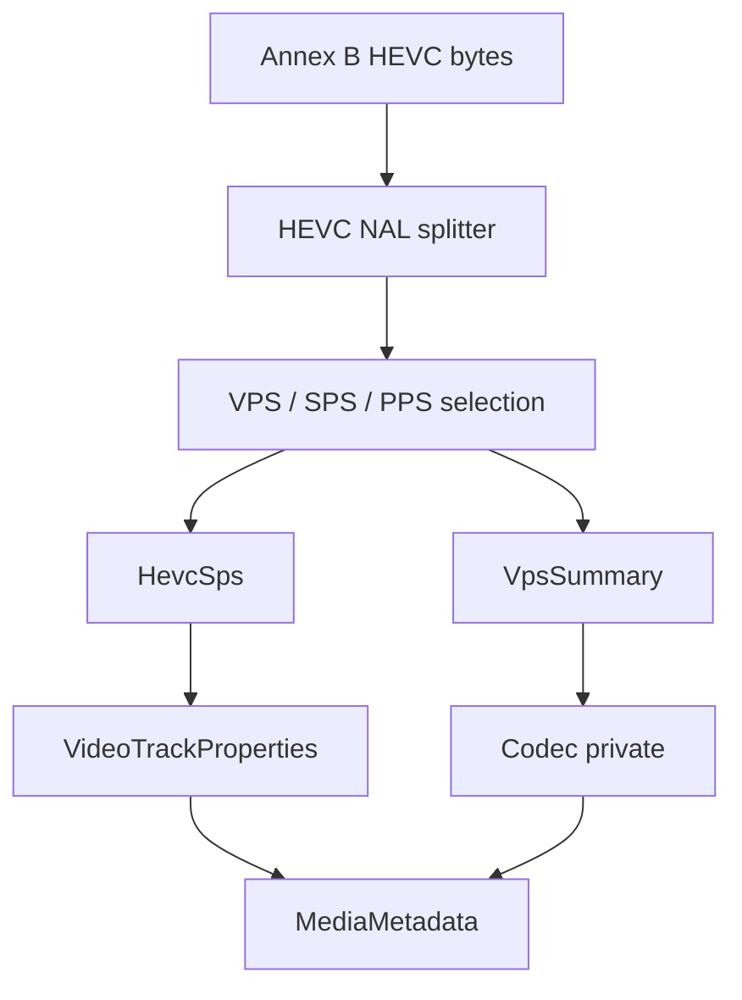

# HEVC / H.265 Elementary Stream Parser

Implementation progress: 72%

## Purpose

The HEVC parser recognises raw Annex B H.265 elementary streams and reports one video track with dimensions, profile, tier, level, chroma format, bit depth, VUI timing when available, and HEVC codec-private bytes.

## Implementation

- Primary implementation: `src-tauri/src/media_metadata/elementary/hevc/reader.rs`
- Helpers: `src-tauri/src/media_metadata/elementary/hevc/nal.rs`, `src-tauri/src/media_metadata/elementary/hevc/sps.rs`, `src-tauri/src/media_metadata/elementary/hevc/vps.rs`
- Upstream basis: `../mkvtoolnix/src/input/r_hevc.cpp`, `../mkvtoolnix/src/input/r_hevc.h`, `../mkvtoolnix/src/common/hevc/*`, `../mkvtoolnix/src/common/xyzvc/*`

The reader splits HEVC NAL units, requires VPS/SPS/PPS style headers, parses `profile_tier_level`, conformance-window crop, chroma and bit-depth fields, and builds a compact codec-private record for the track.

## Data Structures

Key structures are `HevcNalUnit`, `HevcSps`, `HevcTier`, `VpsSummary`, and the internal `HevcHeaders`.

## Gaps and Handling

The Rust parser scans a 64 KiB prefix while upstream can scan much farther. It does not fully cross-check SPS/VPS IDs, does not require a first access unit, and omits some VUI fields such as pixel aspect ratio and color export. Dolby Vision/RPU/enhancement-layer handling and complete hvcC parity are not yet implemented. The parser handles this by emitting only stable base-layer metadata and treating uncertain streams as unrecognised rather than fabricating advanced fields.
