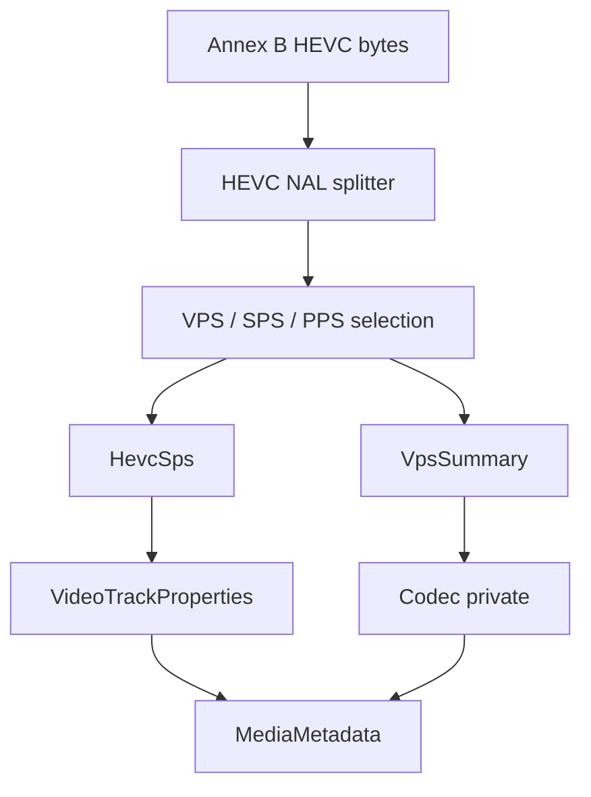

# HEVC / H.265 Elementary Stream Parser

Implementation progress: 80%

## Purpose

The HEVC parser recognises raw Annex B H.265 elementary streams and reports one video track with dimensions, profile, tier, level, chroma format, bit depth, VUI timing when available, and HEVC codec-private bytes.

## Implementation

- Primary implementation: `src-tauri/src/media_metadata/elementary/hevc/reader.rs`
- Helpers: `src-tauri/src/media_metadata/elementary/hevc/nal.rs`, `src-tauri/src/media_metadata/elementary/hevc/sps.rs`, `src-tauri/src/media_metadata/elementary/hevc/vps.rs`
- Upstream basis: `../mkvtoolnix/src/input/r_hevc.cpp`, `../mkvtoolnix/src/input/r_hevc.h`, `../mkvtoolnix/src/common/hevc/*`, `../mkvtoolnix/src/common/xyzvc/*`

The reader splits HEVC NAL units, requires VPS/SPS/PPS style headers, parses `profile_tier_level`, conformance-window crop, chroma and bit-depth fields, and builds a compact codec-private record for the track.

The SPS tail is walked all the way to the VUI: the scaling-list data, the short-term reference-picture-set list (including the inter-prediction path, which depends on the previous set's picture count), and the long-term reference sets are all consumed (`parse_scaling_list_data` / `parse_short_term_ref_pic_set`, ports of `scaling_list_data_copy` / `short_term_ref_pic_set_copy`). This means the VUI timing is reached on ordinary streams that carry those structures, rather than bailing out early. From the VUI the parser reads both the frame timing (`num_units_in_tick * 1e9 / time_scale`) and the sample aspect ratio (predefined `aspect_ratio_idc` table or `EXTENDED_SAR`); `HevcSps::display_dimensions` applies the PAR to the cropped luma dimensions, matching `es_parser_c::get_display_dimensions`.

## Data Structures

Key structures are `HevcNalUnit`, `HevcSps`, `HevcTier`, `VpsSummary`, and the internal `HevcHeaders`.

## Gaps and Handling

The Rust parser scans a 64 KiB prefix while upstream can scan much farther. It does not fully cross-check SPS/VPS IDs and does not require a first access unit. The VUI timing and sample aspect ratio are now extracted (with the scaling-list / reference-picture-set structures consumed to reach them), and a malformed tail degrades gracefully to no PAR / no timing rather than failing the dimensions extraction. Dolby Vision/RPU/enhancement-layer handling and complete hvcC parity are not yet implemented; the parser emits stable base-layer metadata and treats uncertain streams as unrecognised rather than fabricating advanced fields. The `default_display_window` invalid-window workaround (`peek_bits(21) == 0x100000`) upstream applies for malformed streams is not mirrored, as it only affects rare broken bitstreams.
