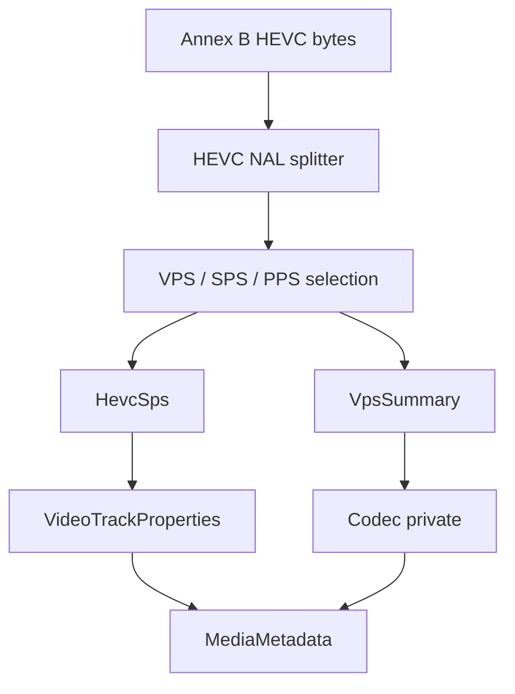

# HEVC / H.265 Elementary Stream Parser

Implementation progress: 100%

## Purpose

The HEVC parser recognises raw Annex B H.265 elementary streams and reports one video track with dimensions, profile, tier, level, chroma format, bit depth, VUI timing when available, and HEVC codec-private bytes.

## Implementation

- Primary implementation: `src-tauri/src/media_metadata/elementary/hevc/reader.rs`
- Helpers: `src-tauri/src/media_metadata/elementary/hevc/nal.rs`, `src-tauri/src/media_metadata/elementary/hevc/sps.rs`, `src-tauri/src/media_metadata/elementary/hevc/vps.rs`
- Upstream basis: `../mkvtoolnix/src/input/r_hevc.cpp`, `../mkvtoolnix/src/input/r_hevc.h`, `../mkvtoolnix/src/common/hevc/*`, `../mkvtoolnix/src/common/xyzvc/*`

The reader scans Annex B HEVC data in 1 MiB chunks, up to the same fifty chunks mkvtoolnix feeds into its HEVC elementary-stream parser. `read_headers` checks the configured parser deadline between chunks. The raw probe rejects a first probe byte of `0x47` to avoid claiming MPEG-TS sync-prefixed data, matching mkvtoolnix's `might_be_xyzvc` guard. The scan splits HEVC NAL units, requires VPS/SPS/PPS headers plus access-unit evidence (slice or AUD), parses `profile_tier_level`, conformance-window crop, chroma and bit-depth fields, rejects SPS entries whose cropped dimensions are zero, and builds a compact codec-private record for the track (PARSER-343).

`parse_profile_tier_level` is a full port of `profile_tier_copy` (`../mkvtoolnix/src/common/hevc/util.cpp:62-103`): it captures `general_profile_space`, the 32-bit `general_profile_compatibility_flag`, and the progressive / interlaced / non-packed / frame-only constraint flags (alongside profile/tier/level). `HevcHeaders::codec_private` then writes a structurally-valid HEVCDecoderConfigurationRecord (port of `hevcc_c::pack`, `hevcc.cpp:293-352`): byte 1 packs `profile_space(2) | tier(1) | profile_idc(5)`, bytes 2-5 the compatibility flags, the constraint flags in byte 6, the level at byte 12, and the reserved-high-bit-filled `min_spatial_segmentation_idc` (byte 13-14, `0x0f` nibble), `parallelism_type` (byte 15, `0x3f`), `chromaFormat` (byte 16, `0x3f`), `bitDepthLumaMinus8` (byte 17, `0x1f`) and `bitDepthChromaMinus8` (byte 18, `0x1f`) — chroma precedes the bit-depth bytes, and byte 21 carries `numTemporalLayers | temporalIdNested | lengthSizeMinusOne`.

The SPS tail is walked all the way to the VUI: the scaling-list data, the short-term reference-picture-set list (including the inter-prediction path, which depends on the previous set's picture count), and the long-term reference sets are all consumed (`parse_scaling_list_data` / `parse_short_term_ref_pic_set`, ports of `scaling_list_data_copy` / `short_term_ref_pic_set_copy`). This means the VUI timing is reached on ordinary streams that carry those structures, rather than bailing out early. Short reads in that tail invalidate the SPS, matching mkvtoolnix's single parse exception boundary. From the VUI the parser reads frame timing (`num_units_in_tick * 1e9 / time_scale`), sample aspect ratio (predefined `aspect_ratio_idc` table or `EXTENDED_SAR`), skips HRD parameters when present, and consumes `bitstream_restriction_flag` to recover `min_spatial_segmentation_idc` and tile-based `parallelism_type` for the hvcC record. `HevcSps::display_dimensions` applies the PAR to the cropped luma dimensions, matching `es_parser_c::get_display_dimensions`. The known-invalid default-display-window pattern (`remaining_bits >= 68 && peek_bits(21) == 0x100000`) is special-cased exactly as `vui_parameters_copy` does — the 1-bit is reinterpreted as `vui_timing_info_present_flag` rather than consumed as a `default_display_window_flag` followed by four bogus offsets — so timing from broken streams is preserved instead of degraded away.

## Data Structures

Key structures are `HevcNalUnit`, `HevcSps`, `HevcTier`, `VpsSummary`, and the internal `HevcHeaders`.

## Gaps and Handling

The Rust parser now uses mkvtoolnix's bounded chunk horizon and MPEG-TS first-byte guard for header discovery. It does not fully cross-check SPS/VPS IDs, and Dolby Vision/RPU/enhancement-layer handling is still out of scope, but acceptance now requires parameter sets plus access-unit evidence and uncertain streams are treated as unrecognised. The VUI timing, sample aspect ratio, HRD skip path, and bitstream-restriction fields are extracted with the scaling-list / reference-picture-set structures consumed to reach them, and malformed tails reject the SPS instead of being defaulted away. The configuration record matches the hvcC byte layout (profile constraints, `min_spatial_segmentation_idc`, `parallelism_type`, chroma/bit-depth offsets, reserved high bits), and the `default_display_window` invalid-window workaround is mirrored.
