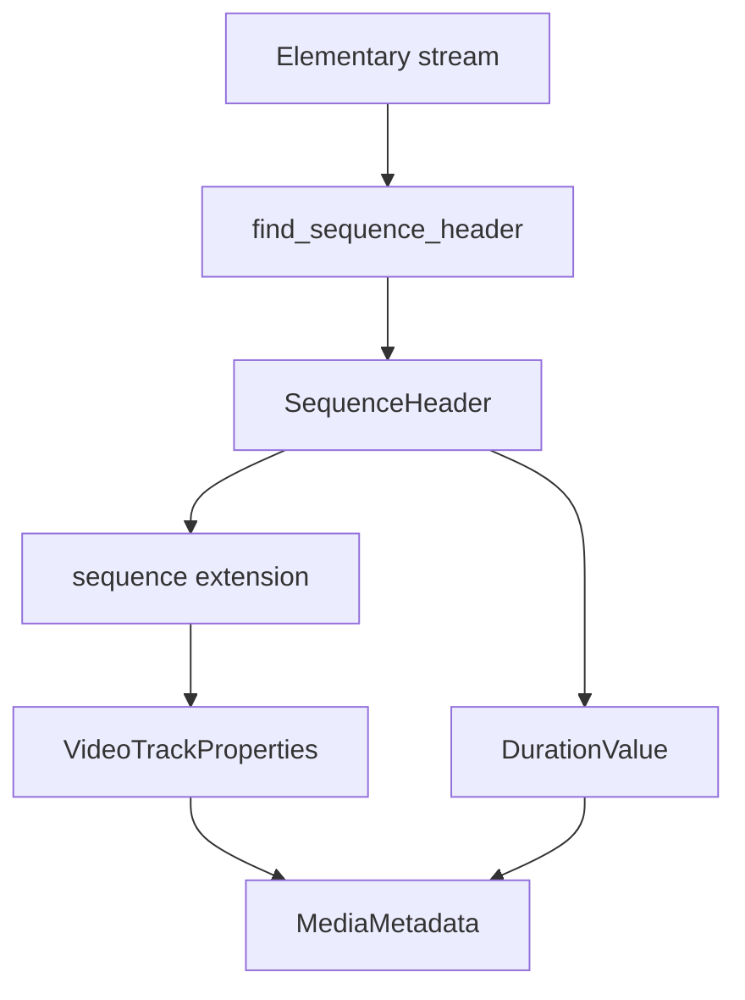

# MPEG-1/2 Video Elementary Stream Parser

Implementation progress: 84%

## Purpose

The MPEG video parser recognises MPEG-1 and MPEG-2 video elementary streams, extracts sequence headers, and reports dimensions, display dimensions, progressive/interlaced state, codec identity, and default frame duration.

## Implementation

- Primary implementation: `src-tauri/src/media_metadata/elementary/mpeg_video.rs`
- Upstream basis: `../mkvtoolnix/src/input/r_mpeg_es.cpp`, `../mkvtoolnix/src/input/r_mpeg_es.h`, `../mkvtoolnix/src/mpegparser/*`, `../mkvtoolnix/src/common/mpeg1_2.*`, `../mkvtoolnix/src/common/mpeg.*`

The parser scans the first 1 MiB for the upstream MPEG ES probe predicates: sequence header, picture start, slice count, whether the file begins with a start code, and the GOP-plus-extension pattern. It accepts only the same structural cases mkvtoolnix accepts before invoking `M2VParser`: a slice pattern from the beginning of the stream, a GOP+extension slice pattern, or at least 25 slice start codes. A bounded frame-header validation then requires a decodable sequence header, nonzero dimensions/frame rate, a valid picture coding type, and a following slice before metadata is reported. Header parsing decodes width, height, aspect-ratio code, and frame-rate code, then applies MPEG-2 sequence-extension fields when available.

## Data Structures

`SequenceHeader` is the main local data structure. It carries dimensions, frame rate, MPEG version, progressive flag, and aspect-ratio-derived display dimensions.

## Gaps and Handling

Upstream uses the full `M2VParser` state machine while reading actual frames. Rust mirrors the probe predicates and validates the first frame-like structure, but it still does not retain parser state for muxing-grade packet validation. The metadata it reports is therefore header-accurate, while full frame delivery remains outside this parser.
