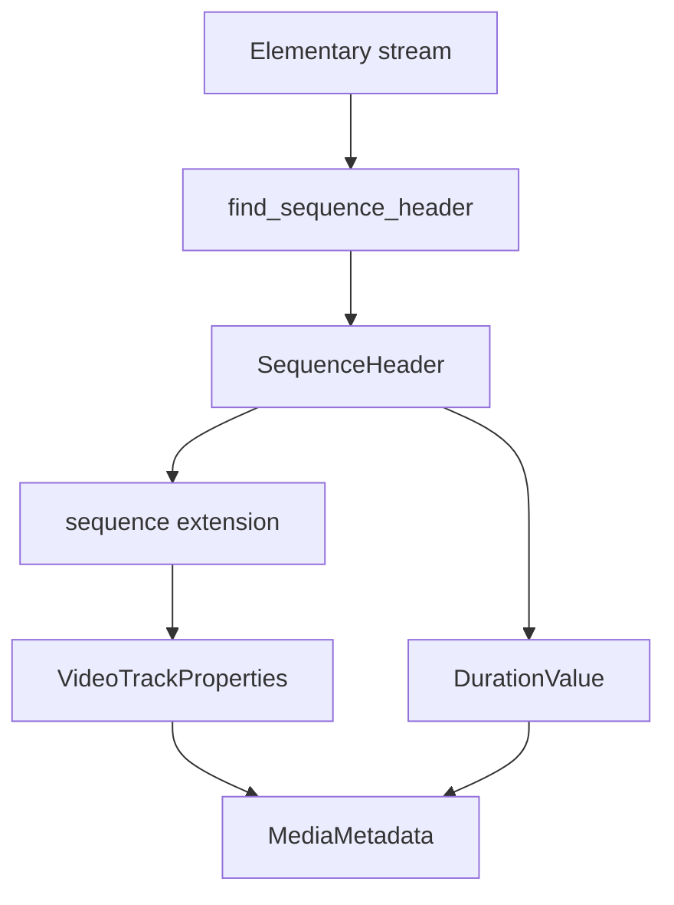

# MPEG-1/2 Video Elementary Stream Parser

Implementation progress: 82%

## Purpose

The MPEG video parser recognises MPEG-1 and MPEG-2 video elementary streams, extracts sequence headers, and reports dimensions, display dimensions, progressive/interlaced state, codec identity, and default frame duration.

## Implementation

- Primary implementation: `src-tauri/src/media_metadata/elementary/mpeg_video.rs`
- Upstream basis: `../mkvtoolnix/src/input/r_mpeg_es.cpp`, `../mkvtoolnix/src/input/r_mpeg_es.h`, `../mkvtoolnix/src/mpegparser/*`, `../mkvtoolnix/src/common/mpeg1_2.*`, `../mkvtoolnix/src/common/mpeg.*`

The parser looks for the `0x000001B3` sequence-header start code, decodes width, height, aspect-ratio code, and frame-rate code, then applies MPEG-2 sequence-extension fields when available.

## Data Structures

`SequenceHeader` is the main local data structure. It carries dimensions, frame rate, MPEG version, progressive flag, and aspect-ratio-derived display dimensions.

## Gaps and Handling

Upstream uses a richer `M2VParser` that validates sequence, picture, GOP, extension, and slice patterns while reading actual frames. Rust uses a simpler header heuristic and does not perform full frame parser validation. The metadata it reports is therefore header-accurate, while muxing-grade stream validation remains outside this parser.

## Open Issues

### PARSER-279 - MPEG video elementary-stream probe is too permissive

`looks_like_mpeg_video_es` accepts any buffer that contains a sequence header followed later by a picture start code and one slice start code. mkvtoolnix's probe is stricter: it tracks whether the file starts with a start code, whether GOP and extension start codes were seen, and how many slice start codes exist, then requires either a start-at-beginning slice pattern, a GOP+extension slice pattern, or at least 25 slices. After that structural pass it still runs `M2VParser` in probe mode and requires `read_frame(...)` to succeed.

Impact: Rust can claim arbitrary or container payload bytes that happen to contain one sequence header, one picture start, and one slice-like code inside the first MiB, even though mkvtoolnix would reject them before identification.

Fix direction: port the upstream probe predicates and add an equivalent bounded frame-parser validation step before accepting an MPEG video elementary stream.
