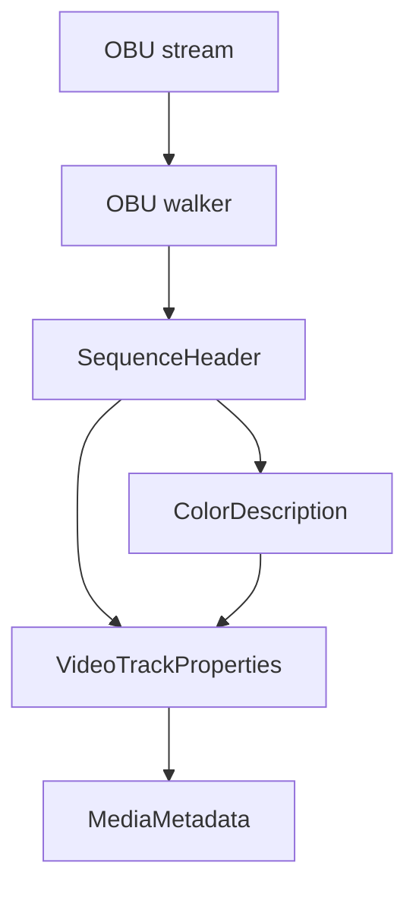

# AV1 OBU Parser

Implementation progress: 68%

## Purpose

The AV1 OBU parser recognises raw AV1 Open Bitstream Units streams and reports one video track with dimensions, profile, bit depth, chroma subsampling, and color metadata when available.

## Implementation

- Primary implementation: `src-tauri/src/media_metadata/elementary/obu.rs`
- Upstream basis: `../mkvtoolnix/src/input/r_obu.cpp`, `../mkvtoolnix/src/input/r_obu.h`, `../mkvtoolnix/src/common/av1.cpp`, `../mkvtoolnix/src/common/av1.h`

The parser decodes OBU headers, LEB128 sizes, sequence headers, operating profile fields, max frame dimensions, bit depth, monochrome/chroma-subsampling flags, and color description fields. Probing requires a sequence header and a frame-like OBU so isolated headers do not claim arbitrary binary files.

## Data Structures

Important structures are `ObuHeader`, `SequenceHeader`, and `ColorDescription`.

## Gaps and Handling

Rust scans a smaller prefix than upstream and accepts some no-size OBU forms that upstream rejects. It does not expose timing/default duration, operating-point filtering, AV1C generation, metadata OBU retention, or Dolby Vision RPU/block-addition mapping. The parser handles this by reporting base AV1 metadata only; IVF has separate first-frame Dolby Vision extraction for wrapped AV1.
