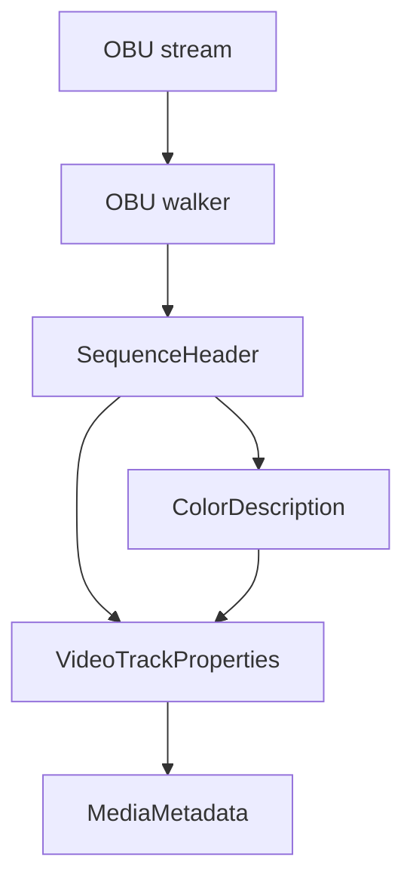

# AV1 OBU Parser

Implementation progress: 72%

## Purpose

The AV1 OBU parser recognises raw AV1 Open Bitstream Units streams and reports one video track with dimensions, profile, bit depth, chroma subsampling, and color metadata when available.

## Implementation

- Primary implementation: `src-tauri/src/media_metadata/elementary/obu.rs`
- Upstream basis: `../mkvtoolnix/src/input/r_obu.cpp`, `../mkvtoolnix/src/input/r_obu.h`, `../mkvtoolnix/src/common/av1.cpp`, `../mkvtoolnix/src/common/av1.h`

The parser decodes OBU headers, LEB128 sizes, sequence headers, operating profile fields, max frame dimensions, bit depth, monochrome/chroma-subsampling flags, and color description fields. Probing requires a sequence header and a frame-like OBU so isolated headers do not claim arbitrary binary files. The OBU walker also requires every OBU to carry `obu_has_size_field`: an OBU without a size field stops the walk (and rejects the stream), mirroring `parse_obu()`'s `obu_without_size_unsupported_x` throw, so size-less raw OBU data that mkvmerge rejects is not claimed.

## Data Structures

Important structures are `ObuHeader`, `SequenceHeader`, and `ColorDescription`.

## Gaps and Handling

Rust scans a smaller prefix than upstream. It does not expose timing/default duration, operating-point filtering, AV1C generation, metadata OBU retention, or Dolby Vision RPU/block-addition mapping. The parser handles this by reporting base AV1 metadata only; IVF has separate first-frame Dolby Vision extraction for wrapped AV1.

## Open Issues

### PARSER-245: Truncated OBUs can satisfy probing

`walk_obus` clamps a declared OBU payload size to the available buffer with `min(bytes.len())` and still visits the OBU. mkvtoolnix's AV1 parser throws `obu_invalid_structure_x` when the declared OBU size exceeds the remaining data. Native can therefore accept a stream where a sequence header is followed by a truncated frame-like OBU, because `has_frame_obu` only checks the type before proving that the whole declared payload is present.

### PARSER-246: AV1 OBU timing, codec-private, and Dolby Vision metadata are not surfaced

The native sequence-header decoder reads timing-info bits only to skip them, never stores `bitstream_default_duration`, and emits `codec_private: None`. It also ignores metadata OBUs, including the ITU-T T.35 Dolby Vision RPU path that mkvmerge's raw OBU reader uses during probing to create block-addition mappings. mkvmerge's AV1 packetizer builds an AV1C codec-private blob from the sequence header plus kept metadata OBUs and applies sequence timing as default duration when present.
