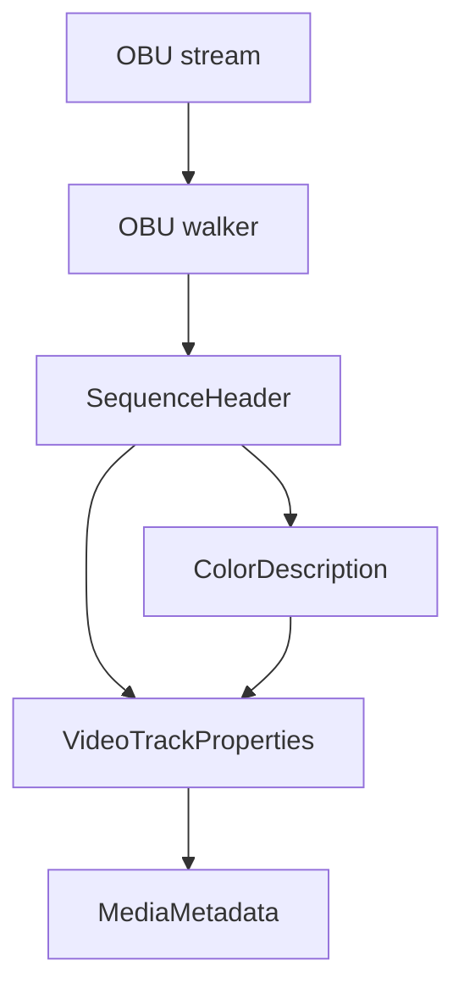

# AV1 OBU Parser

Implementation progress: 92%

## Purpose

The AV1 OBU parser recognises raw AV1 Open Bitstream Units streams and reports one video track with dimensions, profile, bit depth, chroma subsampling, and color metadata when available.

## Implementation

- Primary implementation: `src-tauri/src/media_metadata/elementary/obu.rs`
- Upstream basis: `../mkvtoolnix/src/input/r_obu.cpp`, `../mkvtoolnix/src/input/r_obu.h`, `../mkvtoolnix/src/common/av1.cpp`, `../mkvtoolnix/src/common/av1.h`

The parser decodes OBU headers, LEB128 sizes, sequence headers, operating profile fields, max frame dimensions, bit depth, monochrome/chroma-subsampling flags, and color description fields. Probing requires a sequence header and a frame-like OBU so isolated headers do not claim arbitrary binary files. The OBU walker also requires every OBU to carry `obu_has_size_field`: an OBU without a size field stops the walk (and rejects the stream), mirroring `parse_obu()`'s `obu_without_size_unsupported_x` throw, so size-less raw OBU data that mkvmerge rejects is not claimed.

A single structural pass (`scan_obus`) mirrors `parser_c::parse_obu` (`av1.cpp:414-512`): the `obu_forbidden_bit` aborts the walk, `frame_found` is set when a frame / frame-header OBU's header is read *before* the truncation check (`av1.cpp:431`), and when a declared payload exceeds the remaining bytes the OBU body is **not** parsed and the walk stops (`av1.cpp:434-436`). A truncated sequence header is therefore never decoded (PARSER-245), while a truncated frame still counts as a frame, exactly as upstream.

The reader surfaces the metadata mkvmerge's AV1 packetizer would write (PARSER-246):

- **Default duration** — `timing_info` is decoded (`parse_timing_info`, `av1.cpp:219-231`) into the track `default_duration_ns = 1e9 * num_units_in_display_tick * num_ticks_per_picture / time_scale`.
- **AV1C codec private** — `build_av1c` is a port of `parser_c::get_av1c` (`av1.cpp:554-596`): the 4-byte AV1 configuration record (marker/version, `seq_profile`, `seq_level_idx_0`, `seq_tier_0`, `high_bitdepth`, `twelve_bit`, `mono_chrome`, chroma subsampling + sample position) followed by the raw sequence-header OBU and the kept metadata OBUs (those before the first frame).
- **Dolby Vision** — an ITU-T T.35 metadata OBU carrying the DV RPU payload header yields a `dvvC` block-addition mapping with `maxBlockAdditionId = 4`, mirroring `obu_reader_c::probe_file` (`r_obu.cpp:48-69`). The DV level is computed from the picture rate (`get_frame_duration`, defaulting to 1/25 s), the T.35 payload is converted into the regular RPU byte layout, and the shared IVF/OBU helper parses the RPU header subset needed to derive the profile and compatibility id from the AV1 color metadata.

## Data Structures

Important structures are `ObuHeader`, `SequenceHeader`, and `ColorDescription`.

## Gaps and Handling

Rust scans a smaller prefix than upstream. The Dolby Vision path decodes only the bounded RPU header fields needed for identification and `dvvC` construction; full RPU validation, operating-point filtering, and packet muxing remain mkvmerge's concern.

## Open Issues

### PARSER-284 - AV1 OBU probing stops after 64 KiB

Rust reads a fixed 64 KiB prefix in both `probe` and `read_headers`. mkvtoolnix reads up to 1 MiB into the AV1 parser, flushes it, then requires `headers_parsed()` and nonzero dimensions.

Impact: Raw AV1 OBU streams whose sequence header or first frame-like OBU appears after 64 KiB but before 1 MiB are accepted by mkvtoolnix and missed by Rust.

Fix direction: use the same 1 MiB bounded prefix, still guarded by the parser deadline, and keep the existing sequence-header/frame requirements.

### PARSER-286 - AV1 OBU probe rejects streams that start with metadata

Rust gates `probe` on the first OBU type being temporal delimiter, sequence header, frame, or frame header. mkvtoolnix's AV1 parser accepts metadata OBUs before the sequence header, stores pre-frame metadata, and can still reach `headers_parsed()` after a later sequence header and frame.

Impact: Valid AV1 OBU streams that begin with metadata, including early HDR or Dolby Vision metadata, are rejected by Rust even though mkvtoolnix identifies them.

Fix direction: remove the first-OBU allow-list and let the structural OBU walker decide acceptance from forbidden-bit, size-field, sequence-header, frame, and dimension checks.
