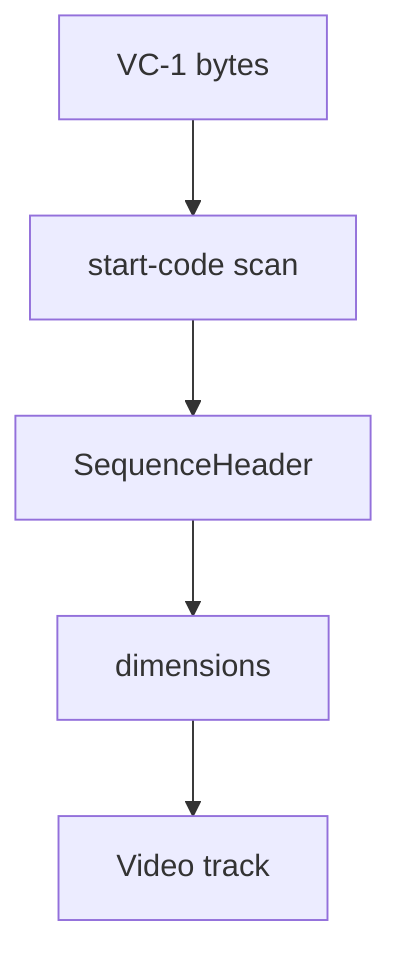

# VC-1 Elementary Stream Parser

Implementation progress: 58%

## Purpose

The VC-1 parser recognises elementary streams with sequence headers and reports one VC-1 video track with basic coded dimensions.

## Implementation

- Primary implementation: `src-tauri/src/media_metadata/elementary/vc1.rs`
- Upstream basis: `../mkvtoolnix/src/input/r_vc1.cpp`, `../mkvtoolnix/src/input/r_vc1.h`, `../mkvtoolnix/src/common/vc1.*`

The parser scans a bounded region for VC-1 start codes, decodes the advanced-profile sequence header fields that contain dimensions, and builds a `ContainerFormat::Vc1` result with `CodecInfo` and `VideoTrackProperties`.

## Data Structures

The central structure is `SequenceHeader`.

## Gaps and Handling

Upstream's VC-1 parser extracts and validates many more fields: profile restrictions, display info, aspect ratio, frame rate, color, interlace flags, HRD, entrypoint state, and coded dimensions from additional headers. Rust currently keeps only the recognition and base dimensions needed for listing the stream. Files requiring advanced VC-1 metadata may therefore be under-described.
