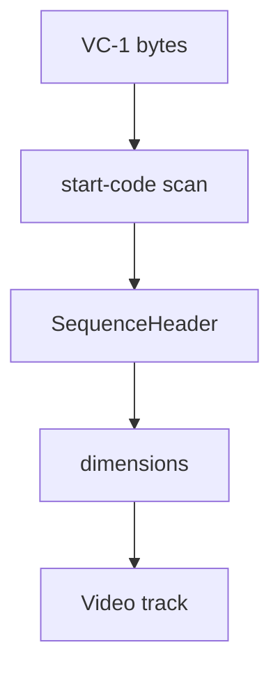

# VC-1 Elementary Stream Parser

Implementation progress: 80%

## Purpose

The VC-1 parser recognises Advanced-profile elementary streams with sequence headers and reports one VC-1 video track with coded dimensions, display dimensions, frame-rate-derived default duration, and the raw sequence/entry-point headers as codec private.

## Implementation

- Primary implementation: `src-tauri/src/media_metadata/elementary/vc1.rs`
- Upstream basis: `../mkvtoolnix/src/input/r_vc1.cpp`, `../mkvtoolnix/src/input/r_vc1.h`, `../mkvtoolnix/src/common/vc1.*`

The parser scans a bounded region for VC-1 start codes and decodes Advanced-profile sequence-header fields, porting the identify-relevant portions of `mtx::vc1::parse_sequence_header` (`common/vc1.cpp`). The two profile bits are checked: a non-Advanced profile (`PROFILE_ADVANCED == 3`) is rejected exactly as upstream's `return false`, so non-Advanced or start-code-shaped non-VC-1 data is no longer claimed. The decoded fields include coded dimensions, the optional `display_info` block (display dimensions, aspect-ratio syntax), the frame-rate syntax (both the explicit `32/den` form and the `nr`/`dr` table form), and the color description, so the track reports display dimensions (falling back to coded dimensions when `display_info_flag` is unset) and a frame-rate-derived `default_duration_ns` (`p_vc1.cpp:61-73`). The raw sequence-header and entry-point bit-stream units are concatenated and stored as codec private, mirroring `m_raw_headers = raw_seqhdr + raw_entrypoint` (`p_vc1.cpp:118-127`). The result is a `ContainerFormat::Vc1` with `CodecInfo` and `VideoTrackProperties`.

## Data Structures

The central structure is `SequenceHeader`.

## Gaps and Handling

The interlace/pulldown/PSF flags are consumed for bit alignment but not surfaced (they are muxing/timing concerns, not identify metadata). The aspect-ratio index is parsed for alignment but the ratio itself is not applied to display dimensions — mkvtoolnix likewise reports the raw `display_width`/`display_height`. Entry-point payload parsing beyond capturing the raw unit for codec private is left to mkvmerge.

## Open Issues

### PARSER-317: Unterminated sequence-header units can be accepted

`decode_sequence_header` finds the next `00 00 01` start-code prefix and treats the end of the current read buffer as the end of the sequence-header unit when no later prefix exists. It then returns `Some(SequenceHeader)` immediately after the optional display/color-description block. Upstream's `mtx::vc1::parse_sequence_header` consumes the mandatory `hrd_param_flag` bit, and, when set, the HRD leaky-bucket fields before returning true. `vc1_es_reader_c` also feeds bytes through `es_parser_c`, whose `add_bytes` only calls `handle_packet` for a previous packet after a following marker has completed that packet; an unterminated final unit remains in the unparsed buffer and is not promoted to an available sequence header.

Impact: a truncated raw VC-1 elementary stream that contains a plausible start code plus enough early sequence bits can be recognised and reported by the native parser, while mkvtoolnix would leave the sequence header unavailable or reject the truncated syntax. The pure parser should not repair an incomplete sequence header into metadata.
