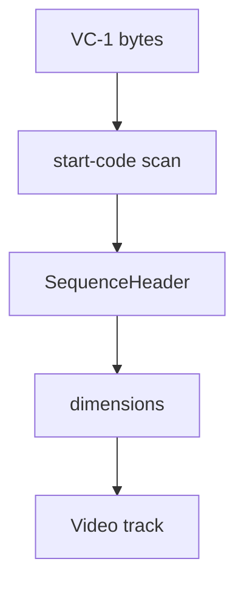

# VC-1 Elementary Stream Parser

Implementation progress: 58%

## Purpose

The VC-1 parser recognises elementary streams with sequence headers and reports one VC-1 video track with basic coded dimensions.

## Implementation

- Primary implementation: `src-tauri/src/media_metadata/elementary/vc1.rs`
- Upstream basis: `../mkvtoolnix/src/input/r_vc1.cpp`, `../mkvtoolnix/src/input/r_vc1.h`, `../mkvtoolnix/src/common/vc1.*`

The parser scans a bounded region for VC-1 start codes, decodes the advanced-profile sequence header fields that contain dimensions, and builds a `ContainerFormat::Vc1` result with `CodecInfo` and `VideoTrackProperties`.

## Data Structures

The central structure is `SequenceHeader`.

## Gaps and Handling

Upstream's VC-1 parser extracts and validates many more fields: profile restrictions, display info, aspect ratio, frame rate, color, interlace flags, HRD, entrypoint state, and coded dimensions from additional headers. Rust currently keeps only the recognition and base dimensions needed for listing the stream. Files requiring advanced VC-1 metadata may therefore be under-described.

## Open Issues

### PARSER-243: Non-Advanced VC-1 sequence headers are accepted

`decode_sequence_header` reads the two profile bits but never enforces `PROFILE_ADVANCED == 3`. mkvtoolnix's `mtx::vc1::parse_sequence_header` returns false immediately for non-Advanced profiles. Native can therefore claim start-code-shaped VC-1 data that mkvmerge rejects, and it interprets the following Advanced-profile fields even when the profile says they are not valid.

### PARSER-244: VC-1 display info, frame timing, color, and codec private data are dropped

The native VC-1 parser stops after the first 40 bits needed for coded dimensions and emits no codec private data. mkvtoolnix continues through `display_info_flag`, aspect ratio, frame-rate syntax, color description, HRD fields, and raw sequence-header storage; the packetizer sets display dimensions, default duration, and codec private data from those parsed headers. Native therefore reports square coded dimensions and no timing/private header for streams whose sequence header carries mkvmerge-visible display or frame-rate metadata.
