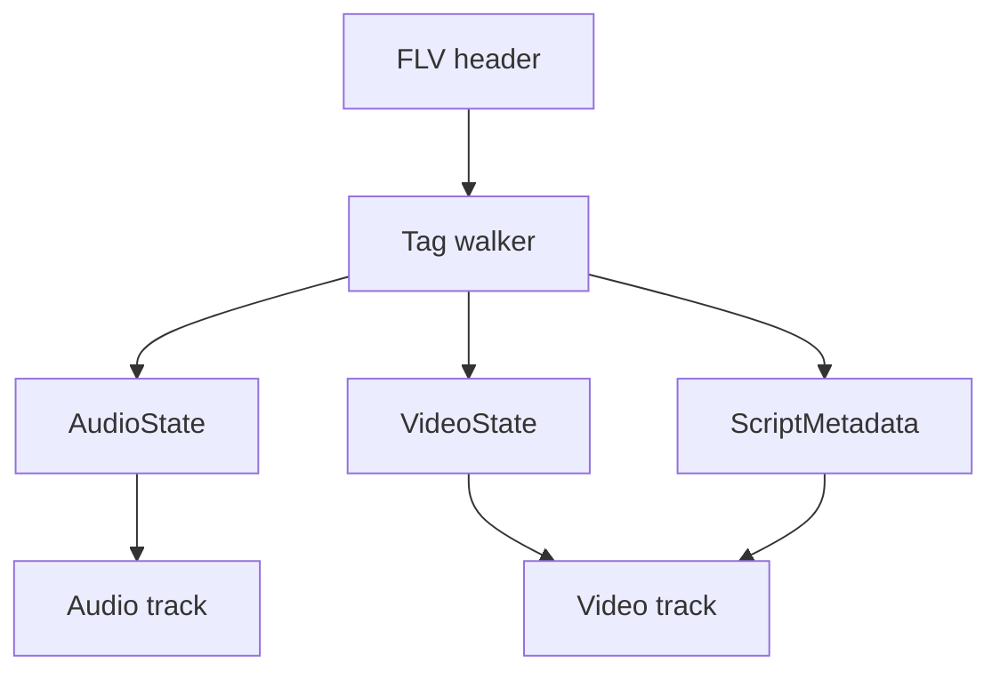

# FLV Parser

Implementation progress: 100%

## Purpose

The FLV parser recognises Flash Video files, reads tag headers, extracts script metadata, and reports audio/video tracks for supported FLV codecs.

## Implementation

- Primary implementation: `src-tauri/src/media_metadata/flv/reader.rs`
- Related modules: `src-tauri/src/media_metadata/flv/header.rs`, `tag.rs`, `script_data.rs`
- Upstream basis: `../mkvtoolnix/src/input/r_flv.cpp`, `../mkvtoolnix/src/input/r_flv.h`, upstream AMF helpers

The parser validates the FLV header, starts tag scanning at the fixed 9-byte header boundary like mkvtoolnix, walks actual tags in a bounded region independent of stale header type flags, skips encrypted tags, decodes AMF0 `onMetaData` values for width, height, and frame rate, and parses AAC, MP3, H.264, H.265, Sorenson H.263, VP6, and VP6-alpha metadata. Clear tag types are classified by exact flag byte (`0x08`, `0x09`, `0x12`) so reserved high bits do not masquerade as audio/video/script tags.

For the per-frame duration mkvmerge reports, the AMF `framerate` wins; for AVC/HEVC the value then falls back to the SPS VUI timing (`num_units_in_tick` / `time_scale`) and finally to mkvmerge's 25 fps default, matching `new_stream_v_avc` / `new_stream_v_hevc` (`../mkvtoolnix/src/input/r_flv.cpp:427-445`, `455-472`). Other codecs keep a default duration only when AMF supplied a frame rate. AVC/HEVC sequence-header tags always preserve the private config bytes and mark the stream discovered; SPS/PPS/VPS parsing only enriches dimensions and structured codec details when the config is complete enough. HEVC `hvcC` fallback fields read `chromaFormat`, `bitDepthLumaMinus8`, and `bitDepthChromaMinus8` from bytes 16, 17, and 18, matching the `HEVCDecoderConfigurationRecord` layout and mkvtoolnix's `hevcc_c::unpack`. AAC tags require the AAC packet-type byte before assigning the AAC codec state; raw AAC packets and malformed sequence headers still create a valid track after that byte, but a one-byte flags-only AAC tag remains invalid like upstream's empty-FourCC path (PARSER-373).

## Data Structures

Key structures are `FlvHeader`, `FlvTagHeader`, `AudioTagFlags`, `VideoCodecId`, `ScriptMetadata`, and internal audio/video state.

## Gaps and Handling

Rust extracts selected AMF fields and does not perform timestamp/min-offset work or packet muxing. AVC/HEVC now mirror upstream's SPS-timing-then-25-fps default-duration fallback and keep sequence-header tracks even when config parsing cannot recover dimensions. Unsupported Screen video codecs are dropped like upstream, encrypted payloads are skipped rather than parsed, and AAC discovery follows upstream's packet-type gate plus flag-derived fallback behavior.

## Open Issues

- `PARSER-393` - Empty AVC/HEVC sequence-header tags still do not establish a video track. The Rust reader only marks H.264/H.265 headers read when the FLV video payload has more than the five bytes used by the video tag header, packet type, and composition time. Mkvtoolnix's `process_video_tag_avc` / `process_video_tag_hevc` read the remaining private-data size even when it is zero, call `new_stream_v_avc` / `new_stream_v_hevc`, apply the 25 fps fallback, clone the empty private buffer, and mark the track headers read.
- `PARSER-394` - FLV audio format 14 ("MP3 8 kHz") reports a hard-coded 8000 Hz sample rate. Mkvtoolnix only uses sound format 14 to choose the MP3 FourCC; `process_audio_tag` then fills `m_a_sample_rate` from the same rate-index table used by regular MP3 (`5512`, `11025`, `22050`, `44100`). Local format-14 files therefore report 8000 Hz even when the encoded FLV rate bits say otherwise.
- `PARSER-395` - FLV audio reports bit depth from the SoundSize flag, but mkvtoolnix never assigns `m_a_bits_per_sample` while parsing supported FLV audio. The upstream reader logs the 8/16-bit size flag but leaves `m_a_bits_per_sample` at its constructor default, including for MP3, raw AAC, and AAC sequence headers. The Rust reader currently emits `audio.bit_depth` for both MP3 and AAC from that flag, inventing metadata that mkvmerge identification does not carry.
