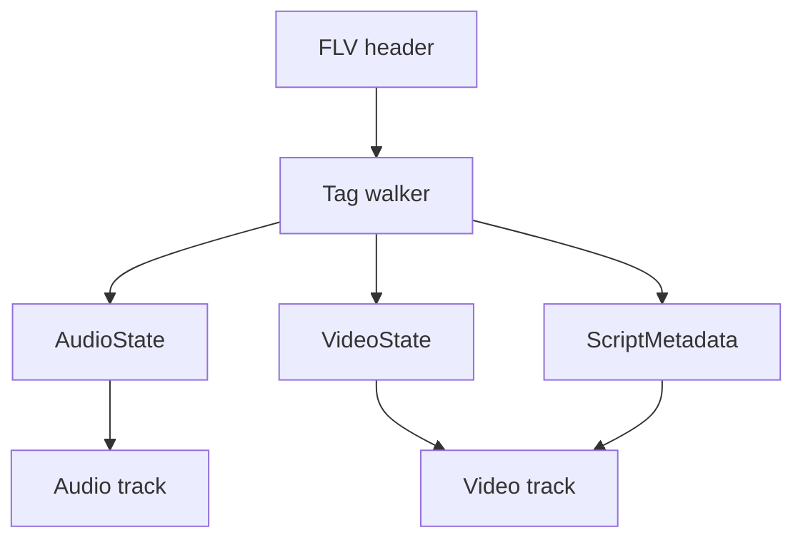

# FLV Parser

Implementation progress: 91%

## Purpose

The FLV parser recognises Flash Video files, reads tag headers, extracts script metadata, and reports audio/video tracks for supported FLV codecs.

## Implementation

- Primary implementation: `src-tauri/src/media_metadata/flv/reader.rs`
- Related modules: `src-tauri/src/media_metadata/flv/header.rs`, `tag.rs`, `script_data.rs`
- Upstream basis: `../mkvtoolnix/src/input/r_flv.cpp`, `../mkvtoolnix/src/input/r_flv.h`, upstream AMF helpers

The parser validates the FLV header, walks actual tags in a bounded region independent of stale header type flags, skips encrypted tags, decodes AMF0 `onMetaData` values for width, height, and frame rate, and parses AAC, MP3, H.264, H.265, Sorenson H.263, VP6, and VP6-alpha metadata.

For the per-frame duration mkvmerge reports, the AMF `framerate` wins; for AVC/HEVC the value then falls back to the SPS VUI timing (`num_units_in_tick` / `time_scale`) and finally to mkvmerge's 25 fps default, matching `new_stream_v_avc` / `new_stream_v_hevc` (`../mkvtoolnix/src/input/r_flv.cpp:427-445`, `455-472`). Other codecs keep a default duration only when AMF supplied a frame rate. AVC/HEVC sequence-header tags always preserve the private config bytes and mark the stream discovered; SPS/PPS/VPS parsing only enriches dimensions and structured codec details when the config is complete enough.

## Data Structures

Key structures are `FlvHeader`, `FlvTagHeader`, `AudioTagFlags`, `VideoCodecId`, `ScriptMetadata`, and internal audio/video state.

## Gaps and Handling

Rust extracts selected AMF fields and does not perform timestamp/min-offset work or packet muxing. AVC/HEVC now mirror upstream's SPS-timing-then-25-fps default-duration fallback and keep sequence-header tracks even when config parsing cannot recover dimensions. Unsupported Screen video codecs are dropped like upstream, and encrypted payloads are skipped rather than parsed.

## Open Issues

### PARSER-294: Reserved FLV tag flag bits are masked away during classification

`FlvTagHeader::parse` stores `tag_type = flags & 0x1F`, and the reader classifies audio/video/script tags from that masked value. mkvtoolnix compares the full tag flags exactly for audio (`0x08`), video (`0x09`), and script (`0x12`), with only bit `0x20` handled separately as encrypted.

Rust can therefore parse a malformed tag such as `0x48` as audio because its low five bits are `0x08`, while mkvtoolnix treats the same tag as unknown. The parser should preserve exact tag-type matching and reject non-encrypted tags with unexpected high bits.

### PARSER-295: FLV `data_offset` is honoured even though mkvtoolnix starts tags at byte 9

After parsing the header, Rust seeks to `header.data_offset` before reading the first previous-tag-size word. mkvtoolnix reads the 9-byte packed `flv_header_t` and then sets the file pointer to `sizeof(m_header)`, ignoring the stored `data_offset` value during header scanning.

Files with nonstandard or corrupt FLV header extension bytes can be accepted by Rust because it follows the offset to the tag stream, while mkvtoolnix starts at byte 9 and may reject or identify different tags. For parity, the native parser should mirror the upstream start position rather than fixing the header offset.

### PARSER-296: Raw or invalid AAC FLV tags do not mark the AAC track valid

Rust marks an AAC track valid only after packet type 0 carries a parseable AudioSpecificConfig. mkvtoolnix sets the AAC FourCC before checking the AAC packet type, ignores the helper's failure in `process_audio_tag`, then fills sample rate/channels from the FLV audio tag flags and marks `m_headers_read = true`.

An FLV whose first bounded AAC tag is raw AAC, or whose sequence header is malformed, can still be identified by mkvtoolnix as an AAC track with flag-derived audio properties. Rust drops that track unless a valid sequence header appears later in the detection window.
