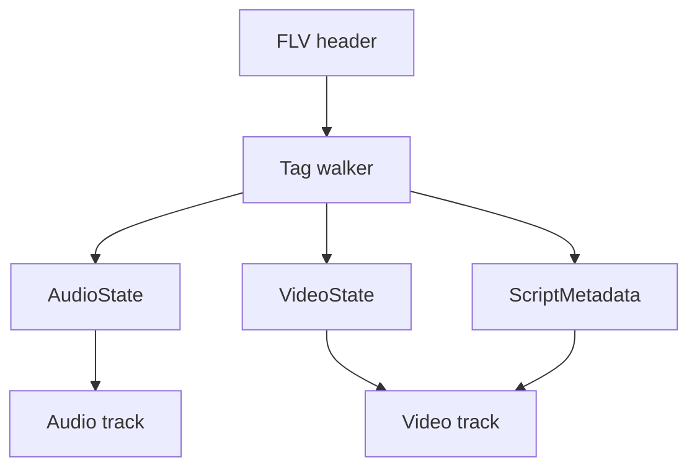

# FLV Parser

Implementation progress: 88%

## Purpose

The FLV parser recognises Flash Video files, reads tag headers, extracts script metadata, and reports audio/video tracks for supported FLV codecs.

## Implementation

- Primary implementation: `src-tauri/src/media_metadata/flv/reader.rs`
- Related modules: `src-tauri/src/media_metadata/flv/header.rs`, `tag.rs`, `script_data.rs`
- Upstream basis: `../mkvtoolnix/src/input/r_flv.cpp`, `../mkvtoolnix/src/input/r_flv.h`, upstream AMF helpers

The parser validates the FLV header, walks tags in a bounded region, skips encrypted tags, decodes AMF0 `onMetaData` values for width, height, and frame rate, and parses AAC, MP3, H.264, H.265, Sorenson H.263, VP6, and VP6-alpha metadata.

For the per-frame duration mkvmerge reports, the AMF `framerate` wins; for AVC/HEVC the value then falls back to the SPS VUI timing (`num_units_in_tick` / `time_scale`) and finally to mkvmerge's 25 fps default, matching `new_stream_v_avc` / `new_stream_v_hevc` (`../mkvtoolnix/src/input/r_flv.cpp:427-445`, `455-472`). Other codecs keep a default duration only when AMF supplied a frame rate.

## Data Structures

Key structures are `FlvHeader`, `FlvTagHeader`, `AudioTagFlags`, `VideoCodecId`, `ScriptMetadata`, and internal audio/video state.

## Gaps and Handling

Rust extracts selected AMF fields and does not perform timestamp/min-offset work or packet muxing. AVC/HEVC now mirror upstream's SPS-timing-then-25-fps default-duration fallback. Unsupported Screen video codecs are dropped like upstream, and encrypted payloads are skipped rather than parsed.

## Open Issues

### PARSER-274: Discovery stops based on FLV header type flags

`src-tauri/src/media_metadata/flv/reader.rs:183-188` stops as soon as the streams declared by the FLV file header are valid, treating `!header.has_audio()` or `!header.has_video()` as "done". mkvtoolnix's `flv_reader_c::read_headers` walks tags until EOF or `FLV_DETECT_SIZE` (`../mkvtoolnix/src/input/r_flv.cpp:251-276`) and creates audio/video tracks from actual tags (`../mkvtoolnix/src/input/r_flv.cpp:805-812`), not from the header type flags.

FLV files with stale header flags can therefore lose streams in Rust. For example, a header that advertises video only lets Rust stop after the first valid video header even if a later audio tag appears within the normal detection window.

Suggested fix: keep scanning the bounded FLV detection region based on actual tags, independent of the header `type_flags`. Stop only when the bounded scan ends or when actual encountered audio/video tracks have enough data for parity-safe early exit.

### PARSER-275: AVC/HEVC tracks are dropped when the sequence config is incomplete

`src-tauri/src/media_metadata/flv/reader.rs:383-410` sets `headers_read` from `parse_avcc` / `parse_hvcc` completeness. Those helpers require SPS+PPS for AVC (`reader.rs:524-528`) and VPS+SPS+PPS for HEVC (`reader.rs:625-629`), so a sequence-header tag with incomplete or partially malformed config leaves the track invalid and it is skipped by `VideoState::is_valid`.

mkvtoolnix is more permissive. `process_video_tag_avc` / `process_video_tag_hevc` set the FourCC, call `new_stream_v_avc` / `new_stream_v_hevc`, and then mark `m_headers_read = true` for packet type 0 (`../mkvtoolnix/src/input/r_flv.cpp:588-623`, `625-661`). The config parsers catch unpacking failures and still return true (`../mkvtoolnix/src/input/r_flv.cpp:427-451`, `455-480`), preserving the track and private data even when dimensions cannot be extracted.

Suggested fix: for AVC/HEVC packet type 0, store the private config and mark the track header as read even if SPS/PPS/VPS parsing is incomplete. Keep dimensions, duration, and structured codec config opportunistic, but do not use their completeness as the track-validity gate.
